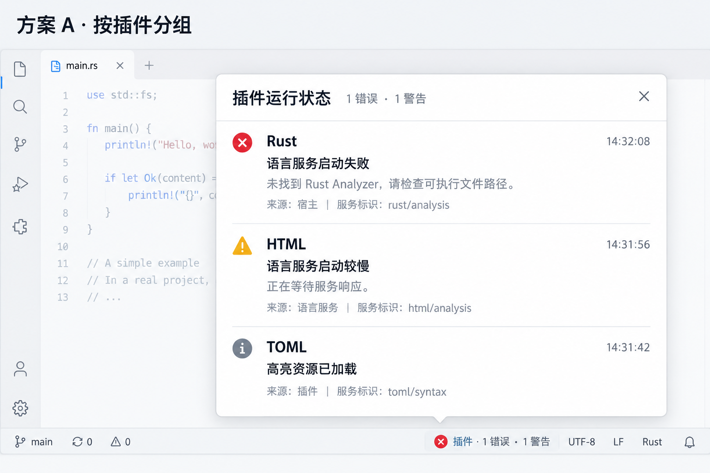

# 插件管理与运行日志改造方案

状态：产品需求、测试边界与工单拆分已确认并发布；#23–#25 全部实现并通过行为验收。日期：2026-10-04。
依据：截图标注、grill-me / grilling 访谈及用户选择的 A 方案；按 to-spec 模板整理。
GitHub 方案：[#22](https://github.com/T-miracle/Editor/issues/22)，标签：`ready-for-agent`。
工单见[实施工单](../tickets/plugin-management-logs/README.md)，本批次独立于已完成的 20 张平台工单。

## Problem Statement

插件说明、服务状态与诊断混在详情里，用户阅读说明时会被运行信息打断；顶部操作与滚动区层次不清晰。底栏加载入口需要同时表达未查看异常，现有弹窗的信息排版不易快速阅读，用户无法一致地追踪查看状态。

## Solution

通过固定顶部操作区和六个 Tab 分开概览与运行日志；用彩色严重程度图标提示未读异常。底栏采用按插件分组的 A 方案摘要，查看后消除本轮提醒，新的异常可再次提醒。两个入口共用日志已读状态。

### 插件管理弹窗

#### 固定区域与操作区

右侧名称、版本、操作区和 Tab 栏固定，只有 Tab 下方内容滚动。切换 Tab 不滚走操作区。
“重启插件”移至顶部操作区，使用普通宽度按钮，位于全局启用选项之前。适用时的顺序为更新、卸载、重启插件、全局启用/禁用、本项目启用；原有按钮条件和操作权限保留。
全局禁用时的“本项目启用”仍位于全局选项右侧。

左侧搜索框与“已安装／插件市场”Tab 的垂直距离缩小；底部“从本机安装”区域内边距缩小，保留正常点击区域。具体尺寸沿项目主题与真实窗口验证确定。

#### 详情 Tab

Tab 使用左侧“已安装／插件市场”相同的下划线样式，位于现有分隔线之上。

| 顺序 | 标题 | 本轮状态与内容 |
| --- | --- | --- |
| 1 | 概览 | 默认选中，展示包内 README |
| 2 | 最新变化 | 置灰、不可选 |
| 3 | 评价 | 置灰、不可选 |
| 4 | 其他版本 | 置灰、不可选 |
| 5 | 其他信息 | 置灰、不可选 |
| 6 | 运行日志 | 当前插件的运行记录 |

中间四项因尚无在线市场而暂不可选，鼠标和键盘均不能激活。不增加未确认的市场服务。

服务就绪、诊断、警告与错误移到运行日志，不再直接插入概览正文。安装、更新、卸载的交互仍使用相应操作对话框。

### 日志范围与保留

包含插件自身输出、语言服务启动/退出/重试，以及宿主归属于该插件的运行信息、警告和错误。每条记录应有稳定身份、插件归属、时间、级别、来源与可读消息；相关服务标识可作为次要信息。
终端交互命令输出留在终端面板，不混入日志。

仅保留本次编辑器进程运行期间的日志；切换插件、关闭管理弹窗不清空，重启编辑器后清空。每个插件有条数上限，超限淘汰最早记录。具体上限属于实现参数，需在实现和验证记录中明确。
实际实现参数：每插件保留 512 条历史，每条最多 8192 个 Unicode 字符。为满足底栏未查看提醒持续显示，另保留最多两个被淘汰但未读、未确认的异常代表（警告、错误各最新一条）；确认本轮提醒或实际查看后释放，不恢复被淘汰历史及其 Tab 未读图标。底栏卡片宽度最多 440 px、高度最多 420 px，并受窗口边界约束。
不提供级别筛选、清空按钮或自动跟随功能。

正常刷新导致的过期 UI 事件应被安全拒绝，不当作插件故障形成红色提醒；保留 revision 校验。持续丢失交互的异常仍需可诊断，不通过全面吞错掩盖。

### 日志 Tab 提醒与共享已读状态

标题左侧只按未读日志的最高严重程度显示图标：错误为红色错误图标，警告为黄色警告图标，普通日志不显示提醒图标。错误优先于警告。
进入某插件的运行日志 Tab 后，将进入时该插件保留的日志统一标为已读。条目自身的级别和颜色保留；之后到达的新记录按其实际展示情况处理，不用旧已读位置覆盖并发新记录。

底栏弹窗与运行日志 Tab 共用记录的已读状态。查看一个插件的日志不清除其他插件未读记录。
底栏弹窗只将实际展示的摘要记录标为已读，未展示的旧记录仍保留未读，直到进入完整日志查看。

### 底栏提醒的生命周期

底栏沿用现有插件加载状态入口。存在未查看异常时，以对应彩色图标替换 loading；优先级为错误、警告、loading。
未查看警告或错误持续显示，直到用户点击底栏查看弹窗。查看后，若仍有插件加载则恢复 loading；没有加载任务则隐藏入口。之后出现新警告或错误再次提醒。

为同时满足“查看弹窗后隐藏底栏提醒”和“未展示旧日志仍未读”，实现必须区分：
- 记录已读状态：用于运行日志 Tab 的未读图标。
- 底栏本次异常提醒是否已查看：打开弹窗后确认本次已到达的提醒，不能仅由所有历史未读记录重新触发。

因此，打开底栏弹窗后可能出现“底栏已隐藏，而某插件日志 Tab 仍有未读图标”，这是已确认行为。
在完整日志中查看某插件后，同步清除该插件对应的底栏提醒；其他插件提醒保留。新到达记录不能被一次较早的查看操作误清除。

### 底栏弹窗：选定方案 A

用户选择“按插件分组”的方案 A：

采用插件名称与时间、状态摘要、具体原因、来源的层次。错误与警告使用对应颜色图标，正文保持易读，服务标识和时间作为次要文字。分组使用轻分隔线，避免大段连续文本。
图片是生成的排版参考；示例日志、数量、背景编辑器和图标细节不代表真实运行状态，最终行为以本方案正文为准。

每个插件只展示最新一条警告或错误摘要；加载中的正常状态沿用原入口职责，不将全部普通历史日志铺满弹窗。
点击插件摘要条目，打开插件管理并定位该插件的运行日志 Tab，查看完整记录。
摘要选择按时间最新；若更早仍有未读错误，提醒严重程度仍按全部适用未读异常计算，不因最新摘要是警告而降级。

弹窗打开时仅展示的摘要变为已读；底栏本轮提醒同时确认并隐藏或恢复 loading。关闭弹窗不删除日志。

## User Stories

1. As an 编辑器用户, I want 在插件管理中默认阅读概览, so that 了解插件用途。
2. As an 编辑器用户, I want 在顶部看到固定的插件名称、版本和操作, so that 阅读长文时仍能操作插件。
3. As an 编辑器用户, I want 使用与左侧一致的下划线 Tab, so that 理解页面切换方式。
4. As an 编辑器用户, I want 看到六个规定顺序的 Tab, so that 找到信息入口。
5. As an 编辑器用户, I want 识别暂不可用的四个 Tab, so that 避免误以为在线市场已经开放。
6. As an 编辑器用户, I want 在顶部全局选项前重启插件, so that 快速恢复运行。
7. As an 编辑器用户, I want 使用保留作用域含义的全局和项目启用选项, so that 控制插件在哪些项目运行。
8. As an 编辑器用户, I want 看到更紧凑的搜索与本机安装区域, so that 为插件列表留出空间。
9. As an 编辑器用户, I want 在独立运行日志页阅读消息, so that 避免插件说明被状态文字打断。
10. As an 编辑器用户, I want 查看插件输出、语言服务生命周期与宿主诊断, so that 定位故障。
11. As an 编辑器用户, I want 识别每条日志的时间、来源、级别与插件, so that 理解事件归属。
12. As an 编辑器用户, I want 让终端命令输出留在终端, so that 避免重复混入诊断日志。
13. As an 编辑器用户, I want 切换插件或关闭弹窗后保留本次运行日志, so that 回来继续排查。
14. As an 编辑器用户, I want 让日志受条数上限约束且随编辑器退出清空, so that 避免无限占用资源。
15. As an 编辑器用户, I want 从 Tab 彩色图标识别未读错误和警告, so that 优先处理异常。
16. As an 编辑器用户, I want 查看日志后消除未读图标但保留条目级别, so that 区分已看过与已修复。
17. As an 编辑器用户, I want 在加载期间优先看到错误或警告图标, so that 避免异常被 loading 遮蔽。
18. As an 编辑器用户, I want 在查看前持续看到底栏异常提醒, so that 避免遗漏问题。
19. As an 编辑器用户, I want 查看异常后恢复 loading 或隐藏入口, so that 避免历史问题持续打扰。
20. As an 编辑器用户, I want 在新异常到达时再次获得提醒, so that 避免一次查看屏蔽后续问题。
21. As an 编辑器用户, I want 按插件阅读最新一条异常摘要, so that 底栏弹窗保持紧凑。
22. As an 编辑器用户, I want 点击摘要直达对应插件的完整日志, so that 继续排查。
23. As an 编辑器用户, I want 在两个入口共享已读状态并保留未展示日志的未读状态, so that 避免误清其他信息。
24. As an 编辑器用户, I want 看到 A 方案分层排版的摘要、原因与来源, so that 快速读懂消息。
25. As an 编辑器用户, I want 保留其他插件和并发新日志的提醒, so that 避免查看操作遗漏问题。
26. As an 编辑器用户, I want 在中英文、深浅主题、键盘操作及缩放下正常阅读与操作, so that 稳定使用。

## Implementation Decisions

- 沿用插件管理、后台工作线程状态发布、宿主管理器和语言服务生命周期接缝；插件记录包含稳定身份、归属、时间、级别、来源与消息。
- 使用通用插件身份，不按具体插件或语言名称分支；终端 PTY 数据不直接变成运行日志。
- 日志已读状态和底栏提醒确认分别建模：打开摘要确认本轮底栏提醒，仅展示记录已读；完整日志页清除对应插件进入时的未读集合。并发新记录不被旧查看操作覆盖。
- 每插件有界内存日志，沿本次编辑器运行期保存；上限在实现时明确并测试边界，不引入持久化。
- 提醒最高级别与摘要最新时间分别计算。最新摘要是警告时，更早未读错误仍可决定错误提醒。
- 复用现有打开插件管理的路径，支持指定插件和日志 Tab；不新增测试专用宿主 API。
- 保留 revision、实例代际和权限检查；正常迟到 UI 回调不作为插件故障，真实异常不被全面吞掉。
- 原生控件使用 gpui-base 的行为能力与项目本地外观，参考 gpui-component 对应公开接口；用户可见文本进入中英文资源。
- 不需要广域机械重构。若复用现有展示需要局部抽取，先保持行为不变并验证，再在对应切片接入新行为，不单设仅做基础层的工单。
- 具体间距沿现有主题并经实际窗口验证；已确定的日志保留与卡片尺寸参数见“日志范围与保留”，不将示意图像素当作契约。

## Testing Decisions

以下测试边界已经用户确认：

主要入口沿用“实际插件包 → Package / Manager → 后台状态发布 → 原生编辑器与插件管理交互”。通过公开生命周期产生事件，从用户可见内容和交互验证结果。需要真实组件时使用现有能力示例夹具，不新增插件专属测试接口。

可借鉴现有原生插件重启恢复测试：安装实际组件，通过后台发布将诊断送到界面，再模拟点击验证恢复；现有插件启动和作用域测试覆盖迟到结果与状态入口，组合 UI 测试覆盖原生输入和 revision 拒绝。对服务启动、退出与重试使用既有受控服务夹具。

纯状态边界以输入事件与可观察输出验证有界保留、已读集合、异常优先级和确认时序，不绑定内部容器或辅助函数。界面测试和原生验收覆盖 Tab 禁用、真实滚动、键盘焦点、长消息、缩放、深浅主题和中英文。

| 编号 | 可观察结果 |
| --- | --- |
| U01 | 六个 Tab 顺序正确，默认概览；四个占位 Tab 鼠标和键盘均不可选 |
| U02 | 顶部与 Tab 固定；概览长文和日志只在下方区域滚动 |
| U03 | 重启位于全局选项前；左侧两处间距按要求缩小 |
| U04 | 当前插件日志有正确来源、时间和级别，概览不再混入运行信息 |
| U05 | 未读错误优先于警告；普通日志无 Tab 提醒图标；查看后图标消退而条目颜色保留 |
| U06 | 关闭弹窗、切换插件保留日志；编辑器重启清空；达到上限后淘汰最早记录 |
| U07 | 底栏错误优先于警告和 loading，查看前持续存在；查看后恢复 loading 或隐藏 |
| U08 | A 方案每插件仅最新异常摘要，点击定位对应插件完整日志 |
| U09 | 摘要只标记展示记录已读，底栏提醒确认后不被旧未读日志重新唤起，新异常能重新提醒 |
| U10 | 查看一个插件不会清除其他插件提醒，并发新日志不会误标已读 |
| U11 | 正常过期 UI 回调仍被拒绝，但不成为插件故障提醒 |
| U12 | 中英文、深浅主题、键盘焦点、缩放及长消息可读性通过原生验收 |

实施阶段执行仓库要求的针对性测试及格式、非 UI workspace 测试和 workspace 编译检查。涉及真实 WASM 的 ignored 用例先构建夹具再显式运行；证据记录实际结果、平台和未验证限制。初始规格整理只执行路径、链接和 diff 检查；#23 的实现验收见[分栏验证](../verification/plugin-management-tabs-verification.md)，#24 见[运行日志验证](../verification/plugin-runtime-logs-verification.md)，#25 见[底栏摘要验证](../verification/plugin-status-popover-verification.md)。

## Out of Scope

- 在线插件市场及四个占位 Tab 的实际功能。
- 日志筛选、清空按钮、自动跟随、磁盘日志持久化和终端命令输出聚合。
- 新增协议版本、未来协议向后兼容策略、多窗口、自由停靠或其他未确认能力。
- 初始规格整理不涉及实现；后续实施按用户对对应工单的执行授权提交、推送并核对关闭。不自动关闭原有父设计议题。

## Further Notes

方案 A 图像是排版参考，已随方案存入仓库；图中样例日志、背景应用与信息数量不代表真实状态。正文优先于生成图片。
需求、测试边界及垂直切片拆分均已确认（2026-10-03）。已发布到 T-miracle/Editor：方案 #22、工单 #23–#25，均标记 ready-for-agent；原生阻塞关系 #24 ← #23、#25 ← #24 已读回确认。保留此前平台设计基线与工单历史。
