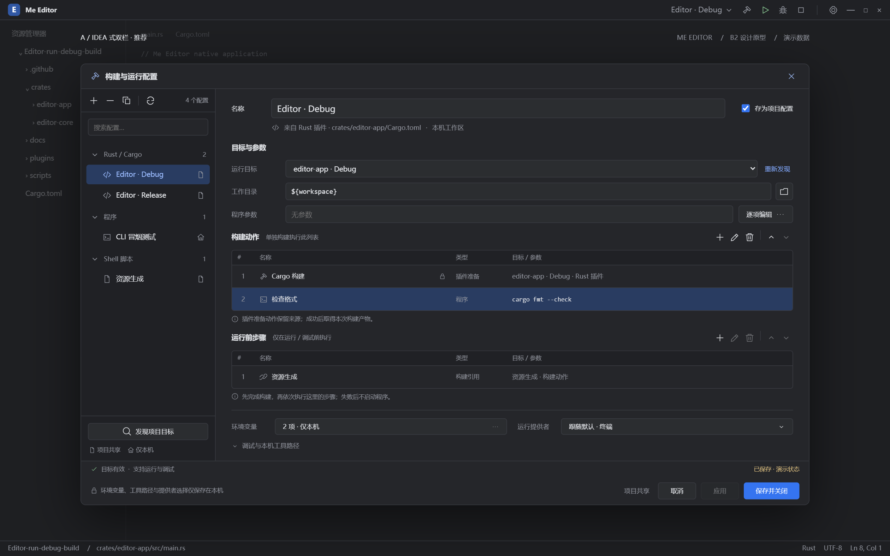
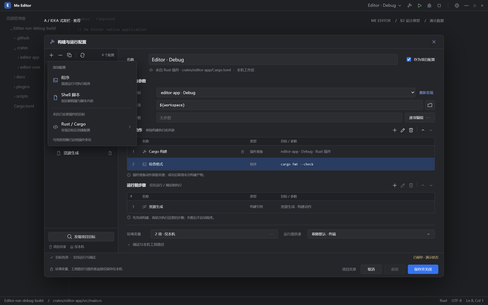
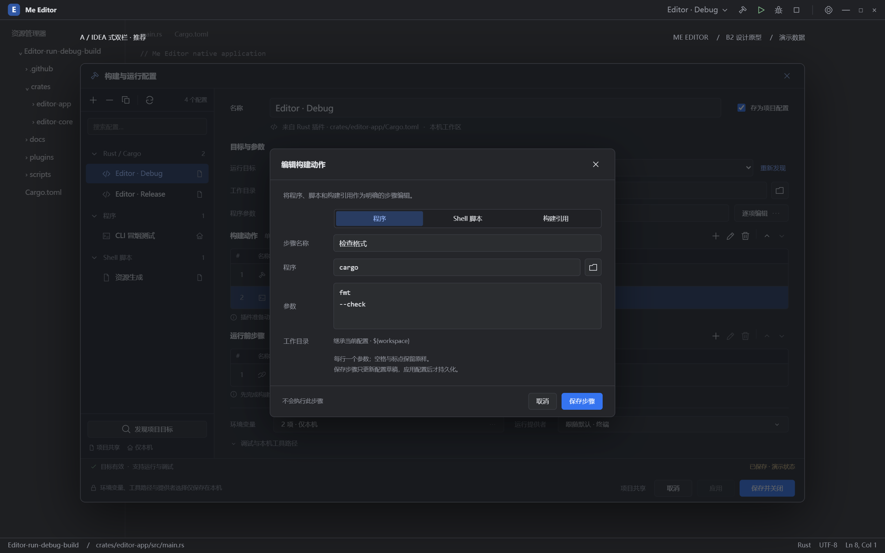

# 构建与运行配置 B2：IDEA 参考设计提案

状态：**用户已选择 A（方案 1）；未替换实际 GPUI 弹窗**。2026-10-06。按用户后续要求进一步简化的设计见 [B3：双栏简洁版](run-config-simple-design.md)，以下三个方案保留为选择依据。

本提案根据用户提供的 IDEA / RustRover 配置截图，优化 Me Editor 的配置管理与步骤编辑。推荐 A，保留 B、C 供比较。既有 [B1 原型](assets/run-config-b1.png) 和 [B1 UI 复验](../verification/run-debug-build-ui-fix-2026-10-06.md) 保留为历史依据；此稿不修改工单验收状态。

## 推荐方案 A



左侧是配置树和图标工具栏，右侧是当前配置的连续表单。名称与共享选项放在第一行，来源放在次要说明行；运行目标、工作目录和参数紧接其后。构建动作和运行前步骤始终可见，环境、提供者及高级设置收在下方。

这样的布局保留 IDEA 的配置管理方式，同时让本项目的两种执行列表清楚可见。用户可以对照目标与步骤修改配置，常用操作不需要在几个页签之间来回切换。

- 左侧图标：添加、删除、复制、重新发现目标。按目标来源或手动类型分组，配置行显示项目共享或仅本机图标。
- 步骤图标：添加、编辑、移除、上移、下移；禁用状态由选中项及边界决定。图标提供悬停说明和可访问名称。
- 步骤表显示序号、名称、类型和目标 / 参数摘要，双击可进入结构化编辑。
- 底部固定显示字段问题、修改状态和保存操作，内容较多时只滚动编辑区。
- 名称、目标和参数的布局对齐；说明使用较弱颜色，选中行和主按钮使用项目的蓝色强调色。

[A 的浅色主题](assets/run-config-idea-a-light.png)

## 其他布局

| 方案 | 结构 | 适用情况与取舍 |
| --- | --- | --- |
| A，推荐 | 配置树 + 连续表单 + 两个步骤列表 | 最接近参考截图，常用信息集中；复杂配置在同一编辑区滚动。 |
| [B](assets/run-config-idea-b-dark.png) | 配置树 + 运行 / 构建 / 调试 / 环境页签 | 每页较简洁，构建页附执行顺序说明；跨类别设置需切换页签。 |
| [C](assets/run-config-idea-c-dark.png) | 配置树 + 执行序列 + 步骤检查器 | 更容易理解较长的步骤链；对窗口宽度要求更高。 |

三者在同一个一次性原型中切换，并使用同一组演示数据。原型用 HTML / SVG 展示设计；正式 UI 仍由原生 GPUI 实现。

## 添加配置



“+”在配置树工具栏下方打开类型菜单：手动程序、显式 Shell 脚本，以及来自已启用插件的目标。图中的 Rust / Cargo 是演示提供者，不构成宿主内置语言分支。插件项先进入目标发现与选择流程，再创建配置。

类型分组只是视图，不新增持久化文件夹或模板系统。重新发现提供候选和修复建议，选定候选后更新绑定；不能因名字相同就覆盖已有配置或丢弃用户字段。

## 结构化步骤编辑



编辑步骤在当前配置窗口内打开遮罩表单，提供“程序 / Shell 脚本 / 构建引用”三种类型：

- 程序：步骤名称、程序路径、字面参数数组；图中参数以每行一项展示，空格保留在该项内。
- Shell 脚本：步骤名称、显式解释器、解释器参数、脚本正文。选择此类型才解释脚本，普通程序参数不通过 Shell 拼接。
- 构建引用：步骤名称、被引用配置、只读的“执行其构建动作”说明。列表使用配置名称帮助选择，保存映射到现行引用契约。

动作步骤继承所属配置的工作目录、环境及工具路径，步骤编辑器只显示这层上下文，不新增独立工作目录字段。构建引用使用被引用配置的构建上下文。

“保存步骤”只更新配置草稿，不立即执行或写入配置文件。插件提供的准备动作显示锁图标与来源，不能作为普通命令删除或改写；它的精确构建产物仍由插件准备结果确定。

## 与现有模型的对应

依据：[RunConfig / RunStep](../../../crates/editor-core/src/run.rs)、[目标发现与准备接缝](run-debug-build-targets.md) 和 [现行计划组装](../../../crates/editor-app/src/run.rs)。

| 可见设置 | 对应的模型或含义 |
| --- | --- |
| 名称、来源、存为项目配置 | `name`、`source`、`local_only`；共享必须显式选择。 |
| 提供者目标、程序或 Shell 脚本 | `RunTarget::Provided / Program / Script`；提供者来源和绑定保留。 |
| 工作目录、程序参数 | `directory` 和目标的 `args`；共享路径可使用 `${workspace}`。 |
| 构建动作 | `build`；点击主窗口构建图标只执行此列表。 |
| 运行前步骤 | `prelaunch`；运行 / 调试先完成构建，再执行此列表，最后启动目标一次。 |
| 构建引用 | `StepTarget::Build`；读取被引用配置当前的构建动作，不启动其最终程序。 |
| 本机环境和工具路径 | `env`、`tool_paths`；即使共享配置，也留在本机。 |
| 运行提供者、调试与断点 | 复用现有提供者选择与配置断点接缝；本机提供者选择不写入共享配置。 |

每个步骤列表沿用现有数量上限。字段校验及目标能力状态来自真实模型和当前提供者，不能因为表单填满就显示“支持调试”。设计图中的目标、环境变量、提供者和状态均为演示数据。

参考截图中的远程目标、Docker、管理员运行及同一配置多实例选项不属于这次设计。现有本机执行能力决定当前可用选项。

## 正式实现时的交互要求

这是下一次原生实现需要满足的设计要求，不能将原型演示行为当作已实现能力：

1. 未保存的配置切换或关闭应保留草稿，或者提供保存 / 放弃 / 取消；取消切换时焦点与选中配置保持一致。
2. “应用”校验并保存当前草稿、保持窗口打开；“保存并关闭”校验并保存后关闭。保存失败显示具体问题，不能清除修改状态；未应用的草稿由取消操作放弃，已经应用的修改不回滚。
3. 新建配置缺少名称、程序、解释器或脚本时显示字段提示，禁用保存。目标缺失、插件禁用或能力不匹配时显示真实原因，保留可修复的配置。
4. 配置树和步骤列表支持键盘选择，图标操作保留工具提示。Tab 按可见逻辑顺序移动；中文 IME 组合输入不能触发提交或快捷键。
5. 参数编辑保留数组边界；引用列表排除自身和不适用的配置，失败不得继续启动目标。
6. 文件与目录按钮使用原生选择器；环境变量使用结构化本机编辑表格。提供者列表从当前可用贡献读取，不写死终端或 Rust 调试器。
7. 使用 `gpui-base` 行为和 `crates/editor-app/src/ui/` 本地外观，用户文本接入中英文 i18n，覆盖深浅主题、缩放和焦点状态。窄窗口内编辑区滚动、底部操作固定；C 的检查器折叠后仍可通过编辑按钮打开步骤表单。

## 查看原型

[原型文件](assets/run-config-idea-prototype.html) 可以直接在浏览器中打开。需要本地 HTTP 预览时，在本工作区运行：

```powershell
# 仅向本机提供一次性设计页面；省略端口会自动选择可用端口。
node docs/plugins/specs/assets/run-config-idea-prototype-server.cjs
```

使用打印的地址，附带 `?variant=A`、`?variant=B` 或 `?variant=C`。底部悬浮栏及左右方向键循环切换；输入字段内的方向键保持编辑功能。`theme=light` 切换浅色，`panel=add` 或 `panel=step` 打开对应状态。

原型只修改内存中的演示对象，不读取真实配置、不调用插件、不执行命令或写入项目。文件选择、发现目标、提供者选择和部分保存语义使用提示桩；原型不用于证明正式配置持久化或执行行为。

## 本次检查

- 已导出并逐张查看 6 张 PNG，尺寸均为 2520 × 1575：A 深浅主题、B、C、添加类型菜单、编辑步骤。
- 在 1680 × 1050 CSS 像素下，三个默认布局的内容均可见，未发现页面横向溢出，底部操作位于弹窗内部。
- 检查了按钮与键盘切换方案、输入字段不拦截方向键、配置搜索、步骤编辑入口、空程序配置的保存禁用状态；浏览器无脚本错误。
- A 在 1060 × 850 下编辑区可以滚动，底部保持可见，未发现页面横向溢出。
- 本次交付仅含设计图、原型及说明；原生 UI、真实输入法、持久化和执行行为的验收留待正式实现。
