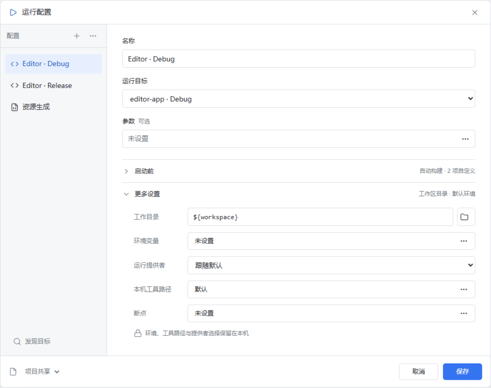

# 构建与运行配置 B3：双栏简洁版

状态：**用户选定的方案 1（A，IDEA 式双栏）已实现为原生 GPUI 弹窗**。2026-10-06。实现与测试见 [B3 验收记录](../verification/run-config-simple-2026-10-06.md)；下方图片仍是设计原型导出图，不作为实际窗口截图。

后续已确认的产品调整见[插件模板、原生表单与配置树重构规格](run-config-plugin-tree.md)。本页保留 B3 历史实现及验证说明；新规格中的插件自定义表单、树与新提交语义尚未据此宣称完成。

用户已选择 [B2 的 A 布局](run-config-idea-design.md)，但认为配置仍然复杂。本稿保留左侧配置列表与右侧编辑区，将常用字段集中在默认视图，将较少修改的内容折叠。用户随后确认按本稿实现，并要求由插件提供默认运行目标；实现复用现有发现、配置与准备契约，不修改工单判据。

用户进一步要求与插件管理相同的置顶窗口：配置界面使用共享 `AppDialog` 的独立原生 `Dialog` 窗口，保持在所属主窗口上方，可通过标题栏拖动，打开时由系统暂时阻止父窗口输入。重复打开激活已有窗口并保留草稿；详情编辑仍留在该配置窗口内，不新增详情 HWND。设计图中的主窗口遮罩不再代表实际窗口机制。

## 默认视图

[深色设计图](assets/run-config-simple-dark.png)

默认弹窗约 940 × 502 CSS 像素；右侧从上到下只有三个字段：

| 字段 | 默认呈现 | 编辑方式 |
| --- | --- | --- |
| 名称 | 当前配置名称 | 直接输入。 |
| 运行目标 | 插件发现的当前目标 | 下拉选择；手动程序配置显示程序路径，脚本配置显示解释器。 |
| 参数 | “未设置”，标明可选 | 点开逐项编辑，保留单个参数内部的空格。 |

不再默认显示来源说明、工作目录、两个完整步骤表或高级设置。左侧使用平面配置列表；顶部工具栏依次提供发现目标（搜索图标）、添加（加号）和更多菜单（复制与删除）。发现按钮仅显示图标，图标有悬停说明和可访问名称；窄窗口同样保留该入口。

“启动前”和“更多设置”默认收起，只显示简短摘要。保存位置移到底部左侧，右侧只保留“取消”和“保存”；保存本身不启动构建或进程。字段错误出现时才显示提示。

脚本配置仍需显示脚本正文，不将必填内容藏在折叠区；“三个字段”描述插件目标和手动程序的常用视图。

## 展开后的内容

“启动前”内仍分为**构建动作**和**运行前步骤**两个列表。列表行只显示名称、目标摘要与编辑图标；添加、移动和编辑在相应列表中进行，详细字段在小型编辑面板中编辑。原生实现将详情放在同一窗口的弹窗内；取消详情返回当前草稿，不关闭配置窗口。插件必须执行的准备动作显示锁定标记，不能作为普通命令删除或越过。

折叠只改变信息的可见性。构建仅执行构建列表；运行和调试继续依次执行构建、运行前步骤与最终目标。构建引用执行所选配置的构建动作，不执行该配置的最终目标，也不复制命令；步骤沿用当前契约中的工作目录与引用上下文规则。

“更多设置”内放工作目录、环境变量、运行提供者、本机工具路径与断点。工作目录默认沿用工作区；本机环境、工具路径和提供者选择继续保留在本机，不随项目共享配置传播。调试继续使用已有默认提供者和断点能力，不在设计中引入未有契约的配置级调试器选择。

## 插件默认目标

可信工作区首次打开配置窗口时，宿主向已启用插件查询目标；列表顶部的搜索图标和加号菜单提供再次发现的入口。目标名称、程序或提供者绑定、默认参数与构建动作来自插件已有公开契约，宿主不根据语言名称或插件 ID 猜测命令。

选择目标只生成未保存草稿，保存后才落盘。提供者绑定保持为不透明数据，不能把显示名称编辑成程序路径；插件必需的准备动作保持锁定。运行时仍由提供者准备并返回该目标的实际产物，构建只执行构建动作，运行和调试使用已有会话流程。再次选择已保存的目标会复用配置，不用插件默认值覆盖用户修改。

插件没有提供目标时仍可手动新建程序或脚本配置。工作目录默认沿用工作区；环境变量和本机工具路径由用户设置，不宣称当前目标契约能提供这些默认值。独立的声明式目标插件与 Rust 插件通过同一流程验证。

## 原生实现约束

- 仍使用原生 GPUI，在本地 `ui/` 层组合 `gpui-base` 行为和项目外观；此原型不作为生产 WebView。
- 使用现有中英文 i18n 资源，保留键盘操作、焦点、中文 IME、缩放与滚动接缝。大量步骤时由编辑区滚动，底部保存操作保持可见。
- 收起区域中的字段仍参与校验；出错时展开相应区域并定位字段。切换配置时保留或明确处置未保存修改，取消恢复已保存状态。
- 执行目标、程序参数和脚本参数保持结构化数据；不将文本拼成 Shell 命令，不按语言或插件 ID 增加宿主业务分支。
- 复制在保存前只存在于草稿；删除有独立确认并立即持久化，外层取消不会撤销已明确确认的删除。

## 原型检查与边界

设计阶段用独立的无头 Edge 渲染一次性原型，导出并逐张查看上述四张图片。检查结果：默认显示 3 个主字段、0 个展开区域、2 个底部按钮；“启动前”展开后仍有演示配置原有的 3 项动作；浅色和深色均无运行时错误。320 像素宽度下无横向溢出；键盘可展开区域，脚本步骤编辑器的操作行未被裁切。参数编辑后 `hello world` 仍为单个参数。

原型的新建、切换、参数和步骤操作只修改内存中的演示数据；保存不会写文件或启动程序。环境变量、工具路径、断点和文件选择仅展示编辑入口，提供者选择未接入宿主。上述检查是设计原型验证，不是实际编辑器的交互验收。

设计和原生实现均仅在 `Editor-run-debug-build` 分支及工作区；没有合并到主工作区 `Editor`。原生测试和真实插件验证的范围及限制单独记录在 B3 验收中。
