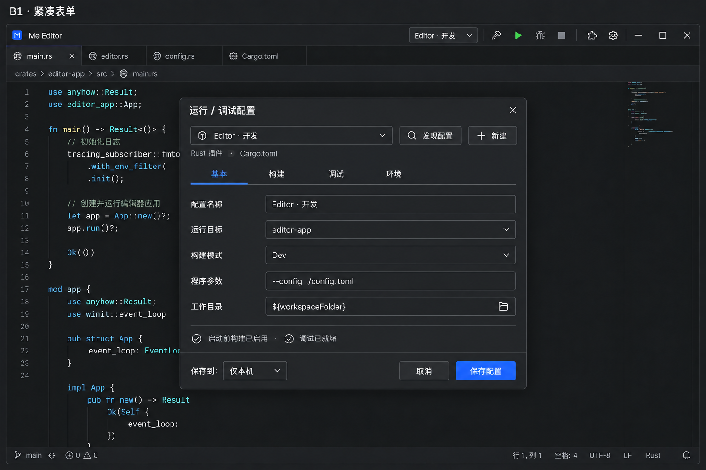

# 运行、调试与构建总方案

日期：2026-10-04

稳定标识：`run-debug-build`

状态：产品范围、B1 交互、12 张工单拆分与测试接缝均已确认；已发布，待实施。

议题：[总方案 #48](https://github.com/T-miracle/Editor/issues/48)；实施工单 #49–#60，均标记 `ready-for-agent`。

## Problem Statement

用户需要从窗口顶栏直接构建、运行或调试程序，而不必每次在终端重新输入命令。当前插件平台虽然有原生进程、终端执行服务和插件间服务调用，但缺少统一的运行配置、活动会话、构建步骤和调试操作入口。仅把按钮连接到一条终端命令，不能可靠表达进程退出、停止、重复启动、断点暂停及插件退出后的清理。

用户还需要同时运行多个相互独立的程序或脚本，查看各自输出，并单独停止或调试。配置应优先由插件发现，允许用户手动创建；执行和调试能力应能由兼容插件提供，而不是将语言、工具或终端名称写进宿主业务逻辑。

## Solution

在总窗口顶栏、插件图标左侧增加统一的运行按钮组，以短竖线分隔。配置与活动会话共用一个分组下拉菜单，旁边提供构建、运行、调试和停止按钮。

每份运行配置独立保存和执行，不同配置可以并行。配置拥有独立的构建操作和顺序执行的启动前步骤；启动前步骤可以引用本配置的构建操作。首期不提供组合配置、跨配置依赖或跨项目编排。

采用用户选定的 **B1 紧凑表单**：顶部配置选择、发现配置和新建入口；中部基本、构建、调试、环境四个标签页；底部保存位置、取消和保存配置。用户确认插件发现的候选项后保存，也可以手动指定程序与参数，或选择解释器编写 Shell 脚本。

宿主统一管理会话、状态、权限、输出定位和调试面板。执行提供者与调试提供者通过公开、版本化能力接口接入。首期以 Rust 的启动调试贯通断点、继续、暂停、单步、变量和调用栈；接口保持语言无关。

## User Stories

1. As an editor user, I want run controls beside the plugin icon, so that I can start development actions without leaving the editor.
2. As an editor user, I want one dropdown for configurations and active sessions, so that the title bar stays compact.
3. As an editor user, I want active sessions and saved configurations grouped separately, so that I can distinguish running work from future launches.
4. As an editor user, I want the selected name and state visible in the title bar, so that I know which target my actions affect.
5. As an editor user, I want selecting an active session to reveal its output or debug view, so that I can resume inspecting it.
6. As an editor user, I want to run different configurations concurrently, so that independent programs do not block one another.
7. As an editor user, I want repeated launch clicks to reveal the existing session, so that I do not accidentally start duplicate services.
8. As an editor user, I want an explicit rerun action, so that replacing a running instance is intentional.
9. As an editor user, I want plugins to discover runnable targets, so that I do not manually reproduce project metadata.
10. As an editor user, I want to confirm discovered candidates before saving them, so that unused targets do not fill my menu.
11. As an editor user, I want discovery to avoid executing my program, so that inspecting candidates does not launch work.
12. As an editor user, I want to create configurations manually, so that custom tools remain usable without a discovery plugin.
13. As an editor user, I want saved configurations to retain my edits, so that rediscovery does not silently overwrite them.
14. As an editor user, I want invalid targets reported with a repair path, so that project changes do not trigger unexpected fallback commands.
15. As an editor user, I want rediscovery to avoid duplicate saved configurations, so that my list stays manageable.
16. As an editor user, I want compact forms with basic, build, debug and environment tabs, so that related settings are easy to find.
17. As an editor user, I want plugin-specific target fields in a consistent host form, so that configuration remains familiar across languages.
18. As an editor user, I want to configure the working directory, arguments and environment, so that launches match my intended context.
19. As an editor user, I want literal program arguments by default, so that special characters are not interpreted as shell commands.
20. As an editor user, I want an explicit shell mode, so that pipelines and multiline scripts are available when needed.
21. As an editor user, I want to choose the shell interpreter, so that scripts do not depend on an implicit terminal profile.
22. As an editor user, I want configurations stored locally by default, so that experimentation does not modify shared project files.
23. As an editor user, I want to opt into project sharing, so that teammates can reuse a configuration.
24. As an editor user, I want personal tool paths and secrets kept local, so that sharing does not expose machine-specific or sensitive values.
25. As an editor user, I want shared configuration files to remain editable, so that I can maintain them with normal project tools.
26. As an editor user, I want configuration errors shown before launch, so that invalid settings do not cause partial execution.
27. As an editor user, I want Build to affect the selected configuration, so that its target is predictable.
28. As an editor user, I want Build disabled when no build action exists, so that an unrelated operation is never substituted.
29. As an editor user, I want build operations separate from launch preparation, so that building does not unexpectedly prepare data or start services.
30. As an editor user, I want launch preparation to reference the current build operation, so that I do not duplicate build commands.
31. As an editor user, I want multiple preparation steps executed in order, so that generated inputs exist before later steps use them.
32. As an editor user, I want a failed preparation step to prevent subsequent steps and launch, so that incomplete preparation is visible.
33. As an editor user, I want modified workspace files saved before running or debugging, so that the program uses my visible code.
34. As an editor user, I want save failures to prevent launch, so that old disk contents are not run by accident.
35. As an editor user, I want one output tab per execution instance, so that concurrent output does not become mixed.
36. As an editor user, I want preparation and program output associated with the same session and labeled by step, so that failures can be traced.
37. As an editor user, I want interactive input when supported by the execution provider, so that command-line programs remain usable.
38. As an editor user, I want closing an output tab to hide it without stopping execution, so that tidying the interface does not terminate services.
39. As an editor user, I want hidden output reopenable from the active-session menu, so that I can inspect ongoing work again.
40. As an editor user, I want Stop to act on the selected session, so that other programs continue running.
41. As an editor user, I want graceful stopping before forced termination, so that programs can clean up.
42. As an editor user, I want an immediate-termination action during stopping, so that an unresponsive program does not trap me.
43. As an editor user, I want stopping preparation to prevent all later steps, so that cancellation does not launch the program afterward.
44. As an editor user, I want a confirmation before leaving a workspace with active sessions, so that I can preserve ongoing work by cancelling.
45. As an editor user, I want owned child processes cleaned up when a session ends by termination, so that execution does not leave unmanaged descendants.
46. As an editor user, I want unsupported debugging disabled with a reason, so that Debug never silently performs a normal run.
47. As a Rust developer, I want to launch a Rust target under a debugger, so that I can diagnose real application behavior.
48. As a Rust developer, I want source breakpoints, pause, continue and stepping, so that I can control program execution.
49. As a Rust developer, I want variables and call stacks for the selected suspended session, so that I can inspect its state.
50. As an editor user, I want a unified debug panel, so that switching debugger plugins does not require learning unrelated interfaces.
51. As an editor user, I want debug controls at the top of that panel, so that the window title bar stays compact.
52. As an editor user, I want breakpoint hits to select the corresponding source and session, so that paused execution is immediately visible.
53. As an editor user, I want a breakpoint in another session to notify rather than disrupt an inspection already in progress, so that debugging views do not jump repeatedly.
54. As an editor user, I want breakpoint hits not to steal focus from another application, so that background debugging does not interrupt other work.
55. As an editor user, I want configurations to follow my default execution provider or use an explicit compatible provider, so that I can choose an appropriate execution environment.
56. As an editor user, I want a missing explicitly selected provider reported instead of replaced silently, so that execution behavior remains predictable.
57. As an editor user, I want affected sessions listed before a provider is disabled, removed or updated, so that I can cancel the operation or knowingly stop them.
58. As an editor user, I want provider crashes to fail affected sessions and clean up resources without replaying commands, so that recovery does not repeat side effects.
59. As a plugin developer, I want to contribute discoverable targets and configuration fields through public interfaces, so that my integration does not require host modifications.
60. As a plugin developer, I want to start, observe and stop authorized executions through typed APIs, so that I can cooperate with terminals and other plugins.
61. As a plugin developer, I want execution handles and lifecycle events distinct from request completion, so that acceptance is not mistaken for program exit.
62. As a plugin developer, I want versioned execution and debugging contracts with explicit ownership, so that providers can be replaced safely.
63. As an editor user, I want workspace trust and installation permissions enforced for every launch source, so that project configuration cannot grant itself execution authority.
64. As a plugin developer, I want stale events rejected after stop, provider replacement or workspace closure, so that old resources cannot alter the current session.
65. As an editor user, I want Chinese and English text, keyboard operation and both themes supported, so that these controls behave consistently with the editor.

## Implementation Decisions

### 1. 范围与现有规格的关系

- 本规格明确增加运行配置、构建步骤、并行独立会话和完整启动调试，替代历史首版“不做任务执行、调试”中与本功能冲突的部分；不引入通用工作流系统。
- 已有插件平台关于公开能力、实例作用域、权限、进程治理、提供者选择和事务更新的约定继续有效。以前终端执行工单“不新增任务系统或调试器”的限制仅界定旧工单，本规格是独立新增范围。
- 保持单根工作区。前后端可以作为不同配置独立启动，但本规格不新增外部项目目录授权、多根工作区或跨窗口协调。讨论过的跨目录组合启动方案未被采用。
- 不同配置可并行；相同配置已有活动会话时定位已有会话。此前提及的“允许同配置多个实例”没有作为独立决策确认，首期不增加该开关。
- 不因本方案自动安装编译器、项目 SDK 或改变全局环境。调试依赖沿已有声明、授权和受管依赖机制处理。

### 2. 领域模型与职责

| 术语 | 含义与边界 |
| --- | --- |
| 运行配置 | 用户保存的可运行目标、参数、环境、构建及调试设置；不是进程或活动会话 |
| 候选配置 | 插件发现的建议，需确认后保存；发现不会自动启动程序 |
| 执行会话 | 一次构建、运行或调试产生的受管执行及其输出、状态与资源归属 |
| 启动前步骤 | 当前配置内的有限顺序准备操作；成功后才进入下一个步骤 |
| 构建操作 | 当前配置的独立构建步骤集合；可被启动前步骤引用 |
| 执行提供者 | 通过公开契约启动、观察、停止程序并承接必要输入输出的插件 |
| 调试提供者 | 提供启动调试、断点、执行控制、栈帧和变量能力的插件 |
| 输出页签 | 会话的展示入口；隐藏或关闭展示不改变会话生命周期 |
| 调试会话 | 执行会话中的调试状态及暂停上下文；不建立第二份可变文档模型 |

- 核心逻辑承接配置验证、会话身份及状态不变量；应用层承接顶栏、保存协调、配置弹窗与调试面板。
- 协议层维护公开类型、能力版本及 SDK；运行时负责路由、权限、实例与资源生命周期；插件实现语言目标发现、构建解析、具体执行和调试适配。
- 复用现有模块，不为每层新建 crate，不添加只转发调用的包装层。入口文件只组装和路由。
- 所有本地控件基于 gpui-base 行为与状态，参考 gpui-component 实现并使用项目主题外观；不用 WebView 实现配置或调试面板。

### 3. 顶栏与选择语义

- 按“统一下拉、构建、运行、调试、停止、短竖线、插件图标”的顺序放置。继续、暂停及单步不挤入窗口顶栏。
- 下拉分为活动会话、运行配置、编辑与发现入口；活动项显示运行中、构建中、暂停中或停止中等状态。
- 选择活动会话，定位其输出或调试界面，同时关联所属配置。停止及调试控制只作用于所选活动会话。
- 选择未运行配置，只改变下一次启动目标，停止按钮禁用；选择已有活动会话的配置则定位已有会话，不进行第二次启动或自动保存。
- 菜单收起显示当前名称与必要状态，避免增加第二个常驻会话选择器。
- 缺少构建操作则禁用构建按钮；缺少调试提供者或调试设置则禁用调试按钮，提供可见原因，普通运行可独立可用。
- 重新运行是明确的独立操作：先按停止规则结束旧实例，再按启动规则执行，不能借重复点击运行隐式中断程序。
- 同一配置正在构建、准备或停止时也属于活动状态；并发请求须在公共会话入口判定，不能只靠按钮置灰防止重复启动。

### 4. B1 配置弹窗

采用已选 B1 的紧凑原生布局、统一左标签右输入、细边框、项目强调色及小圆角。顶部配置选择与“发现配置”“新建”并列，下方显示提供候选的插件与来源。截图中的 Rust 字段由插件贡献，不成为宿主语言特判。

| 标签页 | 内容与约束 |
| --- | --- |
| 基本 | 名称、配置类型对应的目标、工作目录、程序参数；Rust 示例显示可运行目标与构建模式。手动配置选择程序＋参数或显式 Shell 模式 |
| 构建 | 独立构建操作；启动前步骤的新增、删除与排序；可引用“构建当前配置”，失败中止 |
| 调试 | 兼容调试提供者及必需配置、能力缺失原因；执行提供者选择与输出方式的集中入口，避免基本页重复堆叠高级字段 |
| 环境 | 环境变量及本机覆盖；个人工具路径和敏感值不进入共享配置 |

- 底部明确“保存到：仅本机／项目共享”，默认仅本机，右侧取消与保存配置。保存不会启动程序。
- 支持直接编辑共享配置文件；表单和文件读写遵循同一验证契约，不维护两套不同含义的配置。
- 参数本质是参数数组。图中单行展示不构成 Shell 字符串协议；需要处理带空格或特殊字符的参数时提供逐项编辑，避免拼接再猜测分词。
- 原型是布局参考，不是已实现 UI 或既有 API 证据；图中的源码、文件树及调试就绪提示不构成额外产品需求。
- 保留中英文、深浅主题、键盘焦点与操作、中文 IME、滚动和缩放。弹窗应适配受限窗口空间，不能因紧凑布局裁掉字段或操作。

### 5. 配置存储与发现

- 配置需要稳定身份、显示名称、所属工作区、配置类型与来源、运行目标、工作目录、参数或脚本、环境、构建操作、启动前步骤及提供者选择。
- 插件发现后返回候选，用户选择并确认保存；手动配置使用同一管理入口。重新发现不覆盖已保存内容，也不静默生成重复项。
- 候选来源与稳定目标标识用于识别已有配置；目标失效提示修复，用户确认后才更新。不能把同名或类似程序作为自动替代目标。
- 默认本机存储；共享版本使用项目相对定位及明确变量，不写入个人绝对路径、密钥或本机授权。实际提供者选择遵循已有本机工作区与用户选择边界，项目声明不得自动改写授权或选择。
- 配置内容、安装权限、工作区信任是不同概念。共享配置与插件配置都不能授予执行、文件访问或调试权限。
- 文件名、序列化字段名、变量全集与迁移版本尚未在访谈中敲定；实施契约需保持上述语义并版本化，不在总方案中虚构已确定的文件格式。

### 6. 构建、保存与启动

- 构建按钮仅执行所选配置的构建操作及内部顺序步骤，不自动执行其他启动准备，更不启动程序。
- 运行与调试首先验证配置、作用域、权限、提供者与已知必需工具；自动保存当前工作区已修改文件，保存失败不得进入启动前步骤。
- 未命名文件若需要参与本次执行，必须完成另存为；取消保存不得继续以旧文件冒充最新代码。编辑文档通过现有 DocumentSession 与 EditorState 协作，不建立第二份 Rope 或撤销栈。
- 随后顺序执行启动前步骤。引用构建操作时复用定义，不复制一份命令；有限步骤以成功完成为继续条件，失败、取消或停止阻断所有后续步骤。
- 启动前步骤不是后台服务依赖：首期没有等待其他配置就绪、端口探测、循环、分支或自动重试编排。
- 正式启动后持续追踪进程或调试生命周期，不能用“请求完成”代表程序退出。
- 不同配置独立调度，失败或停止一个配置不连带中止其他配置。共享构建目录等外部资源冲突不以扩大为通用调度系统解决，也不宣称已经隔离。
- 实例使用本次启动时解析的配置与提供者上下文，不能让后续编辑或提供者切换改变已发出的命令。迟到事件须校验会话、步骤和实例身份。

### 7. 会话状态与输出

| 状态阶段 | 外部含义 | 可见结果与后续动作 |
| --- | --- | --- |
| 校验／保存 | 尚未进入程序执行 | 失败或取消则不启动任何后续步骤 |
| 启动前步骤／构建 | 当前步骤正在执行 | 展示当前步骤与输出；失败中止 |
| 启动中 | 已请求启动，尚未确认可运行或调试连接完成 | 启动失败不可标为运行中 |
| 运行中 | 普通程序活动，或调试目标正在运行 | 输出独立显示，可停止；调试可请求暂停 |
| 已暂停 | 调试目标在断点、单步等位置暂停 | 显示对应源码、栈帧与变量，可继续或单步 |
| 停止中 | 已阻止后续调度，正在终止拥有的执行 | 正常退出超时后强制终止，可立即终止 |
| 成功／失败／已停止 | 执行已结束，结果归属明确 | 输出中保留本次结果，不将旧事件归入新会话 |

- 表格定义对外语义，不要求将构建状态、进程状态和调试状态塞进一个巨大枚举。
- 每个执行实例有独立输出页签，启动前步骤与正式程序归入同一会话并标记步骤；单独构建也应有可观察的执行与停止目标。
- 终端等执行提供者承接交互输入输出；关闭页签只是隐藏，菜单可重新定位。不能把普通终端原有“关闭并终止”行为直接套用到运行会话展示。
- 会话状态来自执行与调试事件，不通过模拟终端输入、观察提示符或猜测日志判断进程成功退出。
- 输出、订阅、错误与日志延续平台有界队列和资源回收约定。持久历史的保存期限和数量不在本次确认范围内。

### 8. 停止、离开与插件生命周期

- 停止先请求正常退出，允许程序清理；超时后强制终止会话拥有的进程树。“正在停止”状态提供“立即终止”操作。正常退出不支持或失败时必须清晰进入终止路径。
- 已确认超时升级机制；讨论中的 5 秒是示例，最终默认时长及是否可配置属于待落实的契约参数，不冒充已确认产品常量。
- 停止准备步骤时不再执行后续步骤。终止不回滚文件、数据库或外部系统副作用。
- 关闭窗口或切换项目时，若有活动会话先确认；取消留在当前项目，确认后停止会话并清理再离开。首期不提供脱离窗口的后台运行。
- 主动停用、卸载或更新执行／调试提供者时，列出受影响的会话，确认停止后才能进入会造成失效的操作；取消保留会话与当前插件。
- 原有更新准备失败保留旧实例的事务保障继续有效。新增确认属于活动会话与破坏性切换的前置交互，不把更新变成无条件中断或静默重跑。
- 提供者意外崩溃，相关会话失败并清理受管资源；不自动重放命令。旧引用、旧暂停上下文和旧事件不能重新激活新实例的会话。
- 首期只启动调试，不提供附加入口；接口预留外部所有权的区别，未来附加时不得把外部进程按本会话所有进程终止。

### 9. 完整调试体验

- 首期用真实 Rust 程序验收启动调试、源码断点、暂停、继续、单步、变量和调用栈，不以带调试参数的普通运行替代。
- 宿主提供统一调试面板、断点列表及源码定位。继续、暂停、步过、步入、步出等执行控制位于调试面板顶部，依当前状态与提供者能力启用。
- 变量与调用栈必须对应所选会话和当前暂停上下文；继续运行后旧栈帧、变量引用失效，迟到结果不能覆盖另一会话或新的暂停状态。
- 命中断点时切换对应源码、会话与调试视图；其他独立程序继续运行。不抢其他应用的系统焦点。
- 用户正在检查另一暂停会话时，仅提示新断点，不反复切换视图。
- 首期 Rust 验收不意味着宿主写入 Rust 或具体调试器分支；目标发现、产物解析和调试器适配留在插件。
- 具体调试器、是否采用 DAP 及其传输方式尚未确认，属于后续技术选型；不能在本规格中把它们写成用户已经决定的实现。

### 10. 公开 API 契约要求

以下是本次需求推出的公开语义要求，不是现有 SDK 已提供的接口名或已分配能力版本。实现时应在既有能力与服务机制上扩展，补齐消费者和版本协商，不新增按插件 ID 的调用入口。

| 接口面 | 输入与结果必须表达的内容 | 生命周期与权限要求 |
| --- | --- | --- |
| 配置贡献与发现 | 候选身份、来源、类型、表单字段、目标与支持的操作 | 绑定工作区及实例，受信任状态和读取权限约束；失效后撤销候选，保留用户配置 |
| 会话操作 | 明确配置及启动模式；返回会话身份；查询、订阅、定位、停止与重新运行 | 区分启动接受与最终完成；同配置去重；不能借其他插件权限启动 |
| 执行提供者 | 程序＋参数或显式 Shell、目录、环境及输出需求；返回可观察执行句柄 | 状态、输出、退出码、错误、正常停止及强制终止；绑定调用来源、实例和会话 |
| 调试提供者 | 目标、断点和启动参数；暂停／继续／单步；栈帧和变量请求 | 连接与目标状态分开；请求关联暂停上下文；停止时清理调试器与受管目标 |
| 展示与输入 | 会话输出定位、恢复展示、交互输入与必要的尺寸变化 | 隐藏不停止；展示资源与执行资源分别管理，不能通过隐藏绕过资源撤销 |
| 提供者选择 | 跟随默认，或用户单独指定兼容提供者 | 显式选择缺失时报错；既有有效选择不被新安装插件覆盖 |

- `interactive.execute` 当前仅提供执行启动结果，返回 `started` 不代表退出，完成后取消请求也不终止进程。需要扩展生命周期、订阅、停止和展示分离，不能直接当成完整会话 API。
- 既有进程能力已经区分 stdio／PTY、输出、退出、终止和资源句柄；复用这些边界，补充所需环境与正常退出等能力，不绕过受控进程接口。
- “停止等待调用结果”和“停止运行程序”是不同操作。服务请求超时不应丢失已启动程序的归属或使其成为孤儿。
- Shell 模式明确解释器与脚本内容；程序模式保留原始参数数组。宿主不解释某种语言或终端的领域命令，也不借提供者私有 Shell 配置改变用户意图。
- 执行提供者与调试提供者可能不同；两者须关联同一执行会话及其资源所有权，不能分别启动两份目标程序。具体启动握手须在 API 实施工单中定稿。
- 提供者选择可随新启动生效；活动会话绑定启动时的提供者实例，不能中途静默迁移。
- 每个跨插件调用保留来源、能力版本与授权交集，检查资源归属。正常调用不反复请求已授予权限；缺失权限不能由配置文件补授。
- 公共接口需有参数、返回值、错误、超时、取消与资源清理文档。旧包按当前平台基线处理，不新增历史协议运行兼容分支。

## Testing Decisions

### 已确认的测试接缝

优先采用一个主要验收入口：**真实插件包 → 公开 Package／Manager → 宿主会话与原生 UI 集成**。通过公开配置与会话操作发起行为，观察会话事件、实际进程、输出和界面，不增加 Rust／终端专用的测试宿主 API。

现有 Manager 的交互式执行验收已覆盖真实终端、独立替代提供者、委托权限、热更新不重放；原生宿主已有“执行服务显示面板并在停用时回收”的验收先例。扩展这个纵向入口覆盖新会话能力。纯状态与验证逻辑可补就近测试，但不另建一套与公开行为脱节的模拟架构。

原生交互验收是该入口的可见结果验证，不可用协议测试替代。必要的新接缝放在公开会话边界，供真实宿主和插件消费者共同使用，不暴露内部字段、依赖某个插件 ID 或增加仅供测试调用的业务分支。

### 验收矩阵

| 编号 | 行为验收 | 外部可观察证据 |
| --- | --- | --- |
| R01 | B1 弹窗与顶栏 | 顶栏位置、短竖线、统一下拉、四标签及保存位置符合选定原型；无生产 WebView |
| R02 | 插件发现与手动创建 | 候选确认后才保存；手动命令与 Shell 均可执行；发现不启动目标 |
| R03 | 发现更新与失效 | 已保存修改不被覆盖；重发现无重复；失效提示并经确认修复 |
| R04 | 本机与共享 | 默认不改项目文件；共享不泄露个人路径、密钥或授权；文件编辑与表单含义一致 |
| R05 | 保存协调 | 修改文件后运行使用新磁盘内容；保存失败／取消不产生启动副作用；定位已有会话不触发保存 |
| R06 | 顺序准备 | 多步骤严格顺序；任一步失败或停止不继续；终端退出码与会话结果对应 |
| R07 | 构建分离 | 单独构建不执行启动专属步骤；启动引用同一定义；未配置构建时禁用 |
| R08 | 并行与重复启动 | 两个独立配置同时活动；重复或并发点击同配置只定位已有会话；重新运行先停旧实例 |
| R09 | 输出与选择 | 日志不串台，步骤归属正确；关闭页签程序仍运行；下拉可恢复展示；停止只影响所选项 |
| R10 | 停止生命周期 | 正常退出、超时强制、立即终止、子进程清理；中止准备后无迟到启动 |
| R11 | 离开确认 | 窗口关闭和项目切换可取消；确认后清理；无隐式后台脱离 |
| R12 | 提供者可替换 | 同一消费者通过公开契约使用真实终端和不同 ID 的独立执行提供者；宿主不改业务分支 |
| R13 | 提供者退出与更新 | 提示受影响会话，取消保留；崩溃失败清理；旧引用无效且不重放；准备失败保留旧实例 |
| R14 | 受限与授权 | 受限工作区不可执行；拒绝不足授权、跨实例资源和错误版本；配置不能提权 |
| R15 | 启动确认与完成 | started 不等于退出；请求超时、取消等待、进程停止有明确不同结果且无孤儿进程 |
| R16 | Rust 真实调试 | 可运行构建产物，断点命中、暂停／继续、单步、局部变量和调用栈真实可见 |
| R17 | 多调试会话 | 控制只影响选中会话；旧暂停结果不会串台；断点自动定位和防打断策略正确 |
| R18 | 能力缺失 | 缺少调试能力不退化为运行；显式提供者缺失不静默换用；缺工具产生可修复错误 |
| R19 | 参数与路径 | 带空格、引号、中文及 Shell 元字符的参数边界正确；Shell 仅在显式模式解释；路径与权限边界继续生效 |
| R20 | 原生交互 | 深浅主题、中英文、键盘、中文 IME、缩放、滚动、弹窗受限尺寸及状态反馈实测 |

测试只断言外部行为、权限边界、实际进程与资源结果，不锁定内部方法调用次数、私有数据结构或像素级实现细节。故障注入使用可替换的公开插件夹具及隔离目录，不操作用户真实运行会话。

涉及真实 WASM 包的测试先构建所需插件和夹具，再显式运行标记为 ignored 的相关测试；跳过不计为通过。调试器和项目工具链缺失时记录环境缺口，不擅自安装，也不以模拟夹具代替真实 Rust 调试验收。

每个实现阶段完成针对性测试后执行仓库要求的格式、非 UI workspace 测试与 workspace 编译检查；修改应用层追加相关应用测试和原生交互验收；修改 SDK 时执行宿主构建与 SDK 分发验证。本次纯文档整理只检查链接、路径、规范一致性及 diff，不宣称任何功能验收通过。

## Out of Scope

- 组合配置、跨配置依赖图、跨项目一键启动、服务就绪编排、循环、条件工作流和自动重试。
- 多根工作区、外部项目目录的新增授权模型、跨窗口协调、多窗口产品能力及自由停靠。
- 同一配置显式多实例开关、默认后台驻留，以及重启编辑器后自动恢复运行中的进程。
- 首期附加调试、远程调试入口；完整前端浏览器调试或 Node.js 调试插件交付。
- 未经确认的调试器选型、协议传输方案、自动下载编译器或整个项目 SDK。
- 条件断点、日志断点、数据断点、表达式求值、内存／反汇编视图等未讨论的高级调试产品能力。
- 对程序已产生外部副作用的回滚承诺，或原生进程具有 WASM 沙箱安全性的承诺。
- 用宿主白名单或内置语言分支实现执行／调试；把普通终端全部改成运行配置专用终端。
- 本次文档整理直接实施功能、未经拆分确认发布整批议题、自动提交／推送或关闭历史设计议题。

## Further Notes

### 原型与依据

- 用户最终选择的原型：**B1 · 紧凑表单**。下图仅供布局参考；未选 A、B2、B3 或折叠方案不进入实施范围。

- [项目需求基线](../../project/需求整理.md)、[历史开发计划](../../project/开发计划.md)。本规格的新增范围仅替代 Implementation Decisions 第 1 节明确列出的限制。
- [插件平台方案](plugin-api-platform.md)、[交互式执行工单](../tickets/19-terminal-service-consumer.md)、[执行服务验收](../verification/plugin-api-execution-service-verification.md)。
- [公开插件服务契约](../../../documentation/en/sdk/services.md)、[原生进程契约实现](../../../crates/plugin-protocol/src/process.rs)、[现有终端执行服务](../../../plugins/terminal/src/service.rs)。
- 可复用测试先例：[真实包执行测试](../../../crates/plugin-runtime/tests/interactive_execution.rs)、[原生面板执行验收](../../../crates/editor-app/src/extensions/execution_service_tests.rs)。
- [领域约定](../../agents/domain.md)、[议题工作流](../../agents/issue-tracker.md)、[分诊标签](../../agents/triage-labels.md)。未发现单独的相关 ADR 或 CONTEXT 文件，不虚构额外决策来源。

### 尚需定稿的技术细节

调试器及适配协议、配置文件格式与变量集、公共能力版本、错误枚举、执行与调试提供者启动握手、正常退出的默认等待时长，以及单独构建是否采用与运行相同的自动保存策略，需在后续 API／实施设计中明确。此前访谈只确认运行和调试前自动保存，不能静默扩大该行为。

这些项目不改变已确认的交互与功能边界。若技术选型确实迫使产品行为变化，再单独指出具体差异；无需重新访谈已经确定的选择。

### 发布与状态

2026-10-04 用户确认 [12 张垂直切片](../tickets/run-debug-build/README.md)的粒度、直接阻塞关系和测试接缝。

总方案已发布为 #48，12 张工单为 #49–#60；已读回核对 13 个议题的开放状态、ready-for-agent 标签及 16 条原生阻塞边。真实编号与数据库 ID 见[发布记录](../tickets/run-debug-build/publication.json)。GitHub 连接器创建权限不足，本次按仓库约定使用本机已认证 API 完成发布；凭据未写入记录。

总方案发布不等于开始实施，不等于历史工单执行授权自动扩展到新批次。原型保留在本地方案资产中，未上传到 GitHub；公开议题包含完整布局与行为描述，没有指向未提交文件的失效链接。
