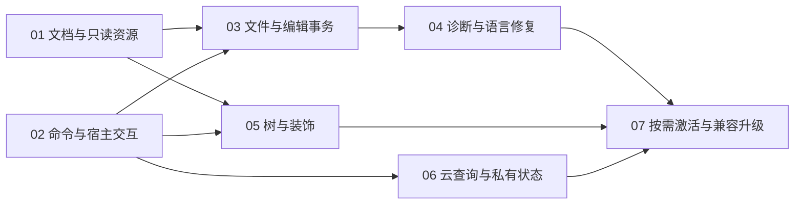

# 基础社区生态：通用插件 API 完善工单

设计议题 [#92](https://github.com/T-miracle/Nanobug/issues/92) 保持开放；实施工单 [#93–#99](https://github.com/T-miracle/Nanobug/issues/93)，完整编号、数据库 ID 和九条原生阻塞边见[发布记录](publication.json)。全部议题已读回核对 `ready-for-agent`，未验收工单保持 open。

日期：2026-10-09

状态：2026-10-09 用户批准七单拆分、九条直接阻塞边与测试接缝，并授权连续执行、创建执行会话及子代理；正在发布与实施，未验收工单保持未完成。

来源：[总方案](../../specs/plugin-api-community-foundation.md)。目标跟踪器为 T-miracle/Nanobug GitHub Issues，发布使用 `ready-for-agent`。本目录按仓库约定保存逐单正文，不另设本地 tracker；工单序号不是 GitHub issue 编号。

## 七个端到端切片

| 工单 | 直接阻塞项 | 可演示交付 | 主责测试 |
| --- | --- | --- | --- |
| [01：文档快照、事件与只读资源比较](01-documents-and-virtual-resources.md) | 无 | 插件读取未保存内容，打开历史/生成文档，与当前文件比较并跟随文档事件 | T01–T05 |
| [02：插件命令、宿主交互与选择授权](02-commands-and-interaction.md) | 无 | 通过菜单/命令调用完成快选、输入、限定文件选择、通知和可取消进度 | T06–T10 |
| [03：工作区文件操作与可撤销批量修改](03-workspace-transactions.md) | 01、02 | 脚手架或批量转换经过预览修改多文件，观察变化并在会话内整组撤销 | T11–T16 |
| [04：多来源诊断与语言修复闭环](04-diagnostics-and-language.md) | 03 | 两种独立检查器发布问题并安全修复；引用查找、代码修复和参数提示进入原生编辑器 | T17–T20 |
| [05：通用树与编辑器装饰](05-trees-and-decorations.md) | 01、02 | 按需树节点、节点菜单、定位、书签与覆盖率标记，在编辑后保持位置一致 | T21–T24 |
| [06：云服务查询、密钥与后台刷新](06-cloud-and-private-state.md) | 02 | 输入 Token 后进行流式云查询，安全缓存与定时刷新，取消或禁用后清理 | T25–T30 |
| [07：按需激活、配置热应用与兼容升级](07-activation-and-compatibility.md) | 04、05、06 | 新旧插件组合按需启动，配置变化、替换与失败恢复可用，隔离开发不污染正常数据 | T31–T35 |

01 与 02 为初始前沿。直接边共 9 条：01→03、02→03、03→04、01→05、02→05、02→06、04→07、05→07、06→07。

### 阻塞依据

- 03 使用 01 的资源身份、快照、版本和事件，使用 02 的选择授权、确认及进度交互。不先增加只能内部调用的临时编辑入口。
- 04 使用 03 的单文档/跨文件编辑与冲突保护；01、02 已经传递满足，不重复标成直接边。
- 05 使用 01 的文档目标和变化事件、02 的节点命令与上下文菜单；无需等待跨文件写入或诊断。Todo 夹具基于已打开文档快照，数据库树使用受控节点数据，验证树通用性不依赖文件监听或网络上线。
- 06 使用 02 的 Token 输入、通知与取消；沿现有私有根扩展缓存，不依赖工作区写入、装饰或语言能力。
- 07 改变各贡献首次启动和重载行为，必须有 04 的语言/诊断、05 的视图与装饰、06 的网络/计时/密钥资源作为真实消费者，验证启用、配置变化、替换及退役的完整行为。它交付实际生命周期能力，不是单独的“最终测试工单”。
- 设计议题是来源，不是必须关闭的阻塞项。图允许多个就绪工单，不代表授权并行代理或同时修改共享文件。

## 测试接缝与各单共同完成条件

已确认的主接缝沿用总方案：独立实际插件包通过正式 SDK、包准入和公开 Manager 进入真实宿主，断言可见文档、磁盘结果、原生界面、事件与资源状态。GPUI 和 Windows 原生输入补足焦点、IME、布局、主题及交互验证，不以内部方法调用次数代替产品行为。

每单均完成对应协议/清单、SDK、运行时、宿主消费者、必要原生 UI、文档、独立插件和行为验证，不按技术层拆单。每个新增能力在自己的工单就具备权限校验、取消、实例归属、禁用清理及稳定/实验声明，不能留到 07 补安全底线。稳定接口的兼容策略在首次交付前明确，07 验证实际组合升级，不负责追补前单缺失的 SDK 或文档。

必要预重构放在所属工单的第一步，先保持行为并通过针对性回归，再增加新能力。当前未发现必须独立启动广域重构的证据；优先复用文档会话、资源句柄、请求分派、语言结果和原生消息接缝。内部资源类型调整保持当前调用方可用，不能借“扩展—收缩”重新引入已拒绝的历史协议兼容分支。

每单必须满足以下共同完成条件 C01–C06：

- **C01 正式接入**：实际插件从公开路径完成端到端行为；修改交付的插件包同步提升清单版本，记录包与能力版本。
- **C02 当前能力安全**：本单的 required/optional、权限拒绝、实例/资源归属、过期/取消和卸载清理有行为证据；需要敏感数据时验证不会进入日志和普通持久化。
- **C03 原生行为**：本单新增交互具备中英文、深浅主题、键盘/焦点、相关 IME/滚动/缩放及基础无障碍验收；与本单无关的界面不重复整套手测。
- **C04 开发者路径**：新增契约附注释和 SDK 用法，明确错误、取消、释放、限额、版本、平台及实验状态；通过独立构建/开发入口，读者说明按站点既定位置维护。
- **C05 验证证据**：记录代码版本或工作树标识、包 hash、SDK/工具链、命令、结果、跳过及环境限制。只标记实际执行通过的测试；未验证不关闭工单。
- **C06 交付检查**：针对性测试先行；每个实现阶段交付执行 `cargo fmt --check`、`cargo test --workspace --exclude editor-app`、`cargo check --workspace`；涉及应用追加对应应用测试与原生交互；实际 WASM 的 ignored 测试显式准备并执行。

## 减少重复而不削弱质量

1. **主责详测只建一处。** T01–T35 各有唯一负责工单。后单引用既有断言与记录，只新增自己的契约/失败行为及跨边界回归，不复制一套同名用例。
2. **开发中用针对性测试定位，收敛后跑交付检查。** 不为每个字段或函数重复全 workspace；若重构形成单独交付阶段，仍执行该阶段规定检查，不靠把阶段改名来跳过门禁。
3. **每单的三项仓库门禁不能省。** 用户要求减少重复测试，通过七个完整切片、共用夹具与明确触发范围实现，不将最后一单全测代替前单验证。
4. **复用包产物，不复用脏运行数据。** 源码、SDK、清单、资源、工具链和构建参数一致时复用同 hash 实际包；任一输入改变就重建对应消费者。每个场景独立数据目录，防止缓存或授权状态掩盖问题。
5. **准确选择回归集。** 共享资源身份/事件变化重跑 T01–T05 及直接消费者；编辑协调变化重跑 T11–T16 及修复/位置跟踪组合；权限/生命周期变化重跑受影响句柄与数据隔离用例；UI 基座变化重跑受影响控件交互。不是只看改动文件名选测试。
6. **前单证据不是新版本通过证明。** 引用时记录差异分析；相关调用路径、SDK 或依赖变化，必须重新运行受影响测试。失败与剩余风险解决前不得靠引用旧记录关闭工单。
7. **最后只补一次组合验收。** 07 在全部能力合齐时执行“按需启动 → 读文档 → 检查诊断 → 预览修改 → 撤销 → 树/装饰更新 → 云查询取消 → 禁用清理 → 失败升级恢复”的短组合。权限、磁盘故障、网络重定向等完整负面矩阵仍复用各主责工单的自动测试，不全部手工重演。
8. **无变化、无失败、无未解风险则不重复。** 每单交付检查已经通过后，不因整理文档或等待发布重新构建全部产品；修改了实际代码、打包输入或集成基线时重新评估受影响检查。

实际夹具使用当前 Cargo、宿主 `--plugin-cargo` 和正式构建入口，不执行历史脚本或归档代理，不擅自安装工具链。全量 workspace 默认不执行应用 UI 和 ignored 测试，必须按上面的独立要求覆盖。

## 35 项主责验收

| 编号 | 主责 | 独立可观察结果 |
| --- | --- | --- |
| T01 | 01 | 文档枚举/范围读取取得当前未保存文本、dirty 与元数据，不能把磁盘内容当快照 |
| T02 | 01 | 打开/关闭/编辑/保存/选区/视口事件及溢出补读可观察，重开资源不复用失效目标 |
| T03 | 01 | UTF-8/UTF-16、CRLF、非 BMP 坐标正确，旧 revision、关闭及越权读取被拒绝 |
| T04 | 01 | 历史内容与生成文本两个插件可打开只读虚拟文档、刷新和比较，无临时文件和隐式写权限 |
| T05 | 01 | 只读资源与文档订阅在关闭、禁用和失败重载后无失效贡献或持续泄漏 |
| T06 | 02 | 命令参数/返回值/错误/取消贯通，跨插件调用不借权 |
| T07 | 02 | 菜单位置、分组、上下文可见/启用正确，禁用后入口撤销，两组底栏职责不变 |
| T08 | 02 | 快选/输入/文件/目录/保存选择的确认与取消可观察，关闭请求不误报成功 |
| T09 | 02 | 外部选择产生限定权限，不能伪造或转授句柄，取消和实例退役后句柄失效 |
| T10 | 02 | 通知归属、确认、进度与取消、焦点/IME/键盘行为贯通 |
| T11 | 03 | 单文档多范围修改经过唯一会话形成合理 Undo 单元；局部 Undo 不影响其他文档 |
| T12 | 03 | stat/列目录/分页发现、创建/写入/复制/改名/删除及工作区/所选外部目标访问完成 |
| T13 | 03 | 同一计划混合打开脏文档、未打开文件与资源操作；预览确认后的保存语义正确 |
| T14 | 03 | 预览后 revision/磁盘变化、关闭、越界、符号链接、设备路径和备用数据流被拒绝 |
| T15 | 03 | 整组撤销恢复内容与资源状态；后续编辑/局部撤销导致冲突时不部分开始自动撤销 |
| T16 | 03 | 文件监听/溢出重扫、提交及撤销 I/O 失败、取消的真实结果与恢复状态明确 |
| T17 | 04 | 拼写与配置检查直接发布多来源诊断，来源可辨，各自只能更新/清理自己的集合 |
| T18 | 04 | 修复经过统一预览/事务入口，旧诊断结果拒绝，禁用后诊断与动作清理 |
| T19 | 04 | 两种独立语言消费者的引用、代码修复、参数提示可用，直接提供者与 LSP 共用呈现路径 |
| T20 | 04 | 补全/格式化/Rename/结构无回退；切换、取消、关闭和过期结果不串文档；新增实验声明正确 |
| T21 | 05 | Todo/数据库树同接口懒加载、分页、刷新、选择及节点菜单，迟到子节点不覆盖新状态 |
| T22 | 05 | 键盘导航、焦点、虚拟化、错误重试与取消符合原生行为，不阻塞 UI |
| T23 | 05 | 书签/覆盖率共享图标、范围标记与说明接口；编辑/Undo 后位置跟踪正确 |
| T24 | 05 | 主题/缩放与基本无障碍可用，关闭文档、禁用和提供者更换撤销树及装饰资源 |
| T25 | 06 | 两种独立云查询通过正式 HTTP/流入口完成请求、分块显示、取消与错误呈现 |
| T26 | 06 | 代理/TLS、目标权限、重定向、限额和回压可验证，不用图片下载或原生进程替代 |
| T27 | 06 | 系统密钥存储隔离读写删除，不进入日志/设置/普通快照；网络和密钥权限独立 |
| T28 | 06 | 跨插件只通过检查调用方权限的服务协作，无法获取对方私有数据或借权调用 |
| T29 | 06 | 私有目录/缓存/临时资源管理、配额及定时刷新/防抖可用，工作区不落私有数据 |
| T30 | 06 | 取消、禁用和失败更新清理网络流/计时器，保留旧版本及受管数据且不泄漏密钥 |
| T31 | 07 | 命令/语言/视图/服务请求分别触发按需激活，并发首次调用只启动一个实例 |
| T32 | 07 | 结构化配置验证、作用域和变化通知/热应用正确，敏感值仍走密钥能力 |
| T33 | 07 | 无空 WASM 要求；后台用途受限；退役不接受迟到请求，全部新资源正确撤销 |
| T34 | 07 | 新旧 SDK、required/optional、稳定/实验与最低宿主规则明确；隔离开发/重载及失败恢复保持正常数据 |
| T35 | 07 | 全部已交付插件完成一次短组合验收、升级权限变化检查与资源清理，记录真实平台限制 |

## 用户故事覆盖与交付边界

总方案 64 条故事均有承接：01 主责 1–8、24–25、56；02 主责 26–30 及 22–23 的选择授权；03 主责 9–23 的编辑、文件和实际访问；04 主责 31–37；05 主责 38–42；06 主责 43–50、52 及持续刷新的资源行为；07 主责 51、53–55 和 57–64 的组合激活/升级。42、55–64 中涉及每个新增能力的 UI、清理、SDK、版本与验收责任同时通过 C01–C06 在当单履行，不延期。

每单正文列出主责用例及需引用的前单场景。夹具只是证明公开接口可复用，不等于额外交付完整数据库客户端、翻译产品或代码托管产品。AI、OAuth 稳定交付和总方案其他范围外能力不进入这些工单。

## 发布安排与授权边界

- 用户已于 2026-10-09 批准七单拆分和测试接缝，并要求实施全部工单；允许自动创建执行会话及调用子代理。
- 已有批准不重复确认；以独立工作区保存本批成果，避免混入同仓库其他任务的未提交改动。
- 发布前按方案与各工单稳定标识查重，先确保设计议题存在，再按 01 至 07 发布；用实际 URL 填充 Parent/Blocked by，保持完整正文并添加 `ready-for-agent`。
- 发布每张工单时将 C01–C06 的共同完成条件内联进正文，使从新上下文领取的代理不依赖本次聊天；本单已列出的 T 编号与可观察断言一并保留，不只发布工单目录摘要。
- 通过 GitHub 原生 issue dependencies 记录九条阻塞边，用数据库 ID 建边并读回核对；若确实不可用，记录原因并保留正文引用，不伪称已建立原生依赖。
- 实际发布后新增 publication.json 记录真实编号、ID、URL、关系与状态；草案阶段不编造远端编号或发布成功记录。
- 不修改或关闭既有父设计议题；按已获授权实施、测试与独立双轴审查、普通提交、推送 origin 并读回关闭实施工单。不得未验证就关闭。
