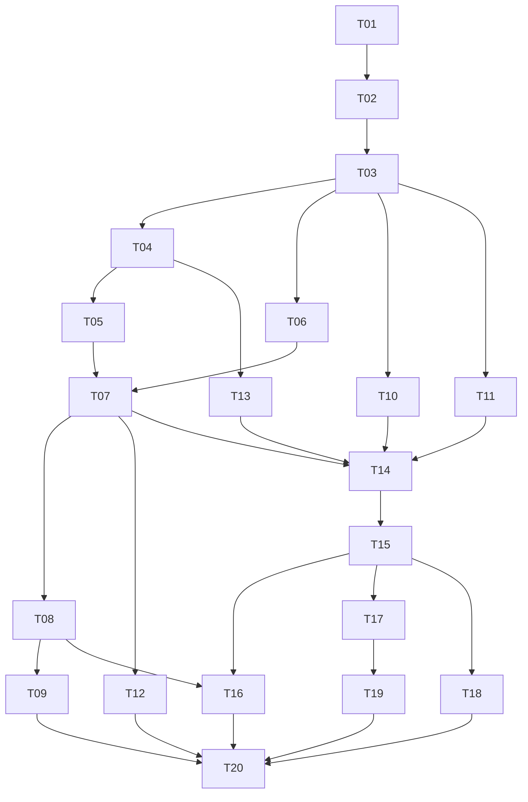

# 插件平台 API 重构：实施工单与发布记录

日期：2026-10-02

来源：[已确认规格](../plugin-api-platform.md)。测试边界已由用户确认。

状态：总方案和 20 张工单已发布，GitHub 是正式议题跟踪器。工单 01–10 已提交推送（`1969094`、`bc3102f`、`c2ca98d`、`9f5a2a7`、`762cc00`、`891651f`、`8bf4790`、`556c061`、`5273c78`、`43923c8`），GitHub #2–#11 已关闭。工单 11 已实现并通过测试及双轴审查，随本提交推送并关闭 GitHub #12。用户已授权连续完成剩余工单，每项通过验证后提交、推送、核对关闭再继续下一项。

设计基线：[GitHub #1](https://github.com/T-miracle/Editor/issues/1)。当前交付：[工单 11 / GitHub #12](https://github.com/T-miracle/Editor/issues/12)；下一项为 [工单 12 / GitHub #13](https://github.com/T-miracle/Editor/issues/13)。验证记录见 [服务契约验证](../plugin-api-services-verification.md)。

## GitHub 议题映射

| 工单序号 | GitHub 议题 | 标题 | 原生阻塞项 |
| --- | --- | --- | --- |
| 01 | [#2](https://github.com/T-miracle/Editor/issues/2) | 安装并运行新能力协议示例 | 无 |
| 02 | [#3](https://github.com/T-miracle/Editor/issues/3) | 在工作区内隔离插件实例并回收资源 | [#2](https://github.com/T-miracle/Editor/issues/2) |
| 03 | [#4](https://github.com/T-miracle/Editor/issues/4) | 通过类型化请求操作编辑器并管理异步事件 | [#3](https://github.com/T-miracle/Editor/issues/3) |
| 04 | [#5](https://github.com/T-miracle/Editor/issues/5) | 在设置界面配置插件并按作用域热生效 | [#4](https://github.com/T-miracle/Editor/issues/4) |
| 05 | [#6](https://github.com/T-miracle/Editor/issues/6) | 安装未知语言并动态选择高亮提供者 | [#5](https://github.com/T-miracle/Editor/issues/5) |
| 06 | [#7](https://github.com/T-miracle/Editor/issues/7) | 按权限启动声明服务与交互式进程 | [#4](https://github.com/T-miracle/Editor/issues/4) |
| 07 | [#8](https://github.com/T-miracle/Editor/issues/8) | 用可选 WASM 钩子启动未知语言的 LSP | [#6](https://github.com/T-miracle/Editor/issues/6)、[#7](https://github.com/T-miracle/Editor/issues/7) |
| 08 | [#9](https://github.com/T-miracle/Editor/issues/9) | 安装语言插件时自动准备私有服务依赖 | [#8](https://github.com/T-miracle/Editor/issues/8) |
| 09 | [#10](https://github.com/T-miracle/Editor/issues/10) | 经额外授权执行依赖安装步骤 | [#9](https://github.com/T-miracle/Editor/issues/9) |
| 10 | [#11](https://github.com/T-miracle/Editor/issues/11) | 在插件面板内组合原生组件与自定义画布 | [#4](https://github.com/T-miracle/Editor/issues/4) |
| 11 | [#12](https://github.com/T-miracle/Editor/issues/12) | 通过版本化服务契约替换插件协作提供者 | [#4](https://github.com/T-miracle/Editor/issues/4) |
| 12 | [#13](https://github.com/T-miracle/Editor/issues/13) | 定位插件超限与 LSP 崩溃并独立恢复 | [#8](https://github.com/T-miracle/Editor/issues/8) |
| 13 | [#14](https://github.com/T-miracle/Editor/issues/14) | 通过隔离数据副本迁移插件私有状态 | [#5](https://github.com/T-miracle/Editor/issues/5) |
| 14 | [#15](https://github.com/T-miracle/Editor/issues/15) | 热切换含服务与界面的插件并在失败时恢复 | [#8](https://github.com/T-miracle/Editor/issues/8)、[#11](https://github.com/T-miracle/Editor/issues/11)、[#12](https://github.com/T-miracle/Editor/issues/12)、[#14](https://github.com/T-miracle/Editor/issues/14) |
| 15 | [#16](https://github.com/T-miracle/Editor/issues/16) | 升级已安装记录并通过新 SDK 重装插件 | [#15](https://github.com/T-miracle/Editor/issues/15) |
| 16 | [#17](https://github.com/T-miracle/Editor/issues/17) | 迁移现有语言包并移除 Rust 专属宿主配置 | [#9](https://github.com/T-miracle/Editor/issues/9)、[#16](https://github.com/T-miracle/Editor/issues/16) |
| 17 | [#18](https://github.com/T-miracle/Editor/issues/18) | 将终端完整迁移到公开进程与组合 UI 能力 | [#16](https://github.com/T-miracle/Editor/issues/16) |
| 18 | [#19](https://github.com/T-miracle/Editor/issues/19) | 迁移示例与 SVG 插件并验证原生 UI 泛用性 | [#16](https://github.com/T-miracle/Editor/issues/16) |
| 19 | [#20](https://github.com/T-miracle/Editor/issues/20) | 用终端服务契约承接执行请求 | [#18](https://github.com/T-miracle/Editor/issues/18) |
| 20 | [#21](https://github.com/T-miracle/Editor/issues/21) | 删除旧协议并完成完整契约验收 | [#10](https://github.com/T-miracle/Editor/issues/10)、[#13](https://github.com/T-miracle/Editor/issues/13)、[#17](https://github.com/T-miracle/Editor/issues/17)、[#19](https://github.com/T-miracle/Editor/issues/19)、[#20](https://github.com/T-miracle/Editor/issues/20) |

## 拆分原则

- 每个工单完成一个可从插件包、公开 API 或原生界面观察的端到端行为，包含声明、宿主集成、调用方与验证。
- 复用现有 Package/Manager 和编辑器集成入口；不为每个插件新增测试 API，也不先制作没有消费者的完整抽象层。
- 每张工单单独成文，写明验收条件、直接阻塞项、验证方式及规格验收编号。工单正文不绑定易过时的代码路径。
- 仅列直接且必要的门槛；传递依赖不重复列出。共同修改一个模块不自动构成功能阻塞，但实现时应协调工作区冲突。
- 必要的局部预重构先完成并保持行为不变，再在同一工单中交付功能。目前没有发现必须先进行一次全仓纯搬迁的必要条件。
- 广域协议迁移采用扩展—迁移—收缩：01 建立新形式；后续切片验证实际能力；15–19 迁移已有记录和消费者；20 删除旧运行形式。
- 新旧形式并存仅是开发过渡，不建立永久兼容层，也不发布半迁移产品。目标仍为统一新基线并明确拒绝旧协议包。
- 能力初次接入时即包含基本权限、作用域和回收；12、14 负责加深故障恢复与组合事务，不能作为前序忽略基本约束的理由。
- 每个工单以相关测试保持绿色为目标。若广域变更确实无法独立保持绿色，必须显式更新计划并使用集成分支，不默默把失败推到最后。

## 编号工单与直接阻塞项

1. **[安装并运行新能力协议示例](01-capability-bootstrap.md)**
   **Blocked by:** 无，可先开始。
   **What it delivers:** 通过宿主公开构建入口构建一个独立示例包，安装后展示界面并完成一次类型化包资源读取。能力不满足时，在激活前获得明确说明。

2. **[在工作区内隔离插件实例并回收资源](02-scoped-instances.md)**
   **Blocked by:** 01。
   **What it delivers:** 同一示例插件在两个逻辑工作区保持独立数据与状态；关闭工作区或禁用插件后，相关资源归零。显式应用级示例可跨工作区继续运行。

3. **[通过类型化请求操作编辑器并管理异步事件](03-typed-requests-events.md)**
   **Blocked by:** 02。
   **What it delivers:** 示例插件读取选区、保存文档、隐藏自身面板，并订阅文档变化；耗时请求有明确进度，可取消或超时，停用后不再收到事件。

4. **[在设置界面配置插件并按作用域热生效](04-declarative-settings.md)**
   **Blocked by:** 03。
   **What it delivers:** 示例插件通过声明生成基础设置界面，显示有效配置来源；用户确认的项目值覆盖全局值，错误配置被明确指出。

5. **[安装未知语言并动态选择高亮提供者](05-dynamic-language.md)**
   **Blocked by:** 04。
   **What it delivers:** 安装宿主从未认识的语言资源包后，已打开文件立即获得识别与高亮；另一个包可以替换其能力，卸载后按候选数量接替或降级。

6. **[按权限启动声明服务与交互式进程](06-native-process-capabilities.md)**
   **Blocked by:** 03。
   **What it delivers:** 示例插件能启动获批的标准输入输出服务，另一个明确获授任意命令权限的示例能启动交互式进程；越权启动失败，停用后进程退出。

7. **[用可选 WASM 钩子启动未知语言的 LSP](07-generic-lsp.md)**
   **Blocked by:** 05、06。
   **What it delivers:** 未知语言插件使用用户指定的本机测试 LSP，按需运行配置钩子；安装后已打开文档即可获得诊断和至少一种导航或补全结果。

8. **[安装语言插件时自动准备私有服务依赖](08-managed-dependencies.md)**
   **Blocked by:** 07。
   **What it delivers:** 未预装服务的干净环境中，用户安装语言插件并授权后自动下载、校验和解包服务，随后启动 LSP；下载失败在管理界面可见且可重试。

9. **[经额外授权执行依赖安装步骤](09-authorized-installers.md)**
   **Blocked by:** 08。
   **What it delivers:** 确实需要安装程序的服务在安装弹窗中说明用途，用户授权后完成私有安装；拒绝不执行脚本，缺少大型 SDK 时由用户主动选择。

10. **[在插件面板内组合原生组件与自定义画布](10-composable-ui.md)**
   **Blocked by:** 03。
   **What it delivers:** 一个独立插件用标准工具栏控制自定义画布，并提供原生输入框与编辑器内预览；焦点、输入法、尺寸和主题交互完整可用。

11. **[通过版本化服务契约替换插件协作提供者](11-plugin-services.md)**
   **Blocked by:** 03。
   **What it delivers:** 一个消费者插件调用两个可互换提供者之一，切换提供者不修改消费者；缺少服务、提供者退出或越权请求有可见结果。

12. **[定位插件超限与 LSP 崩溃并独立恢复](12-fault-recovery.md)**
   **Blocked by:** 07。
   **What it delivers:** WASM 钩子超限或语言服务崩溃时，用户在插件状态中看到原因，有限重试后可手动重启，编辑器和其他插件继续可用。

13. **[通过隔离数据副本迁移插件私有状态](13-data-migration.md)**
   **Blocked by:** 04。
   **What it delivers:** 安装数据格式升级的插件版本时，用户设置通过插件钩子转换；迁移失败保留旧数据，准备期间旧版本写入不会丢失。

14. **[热切换含服务与界面的插件并在失败时恢复](14-transactional-hot-update.md)**
   **Blocked by:** 07、10、11、13。
   **What it delivers:** 一个同时拥有私有状态、服务和界面的插件可以在编辑器运行时更新；新版本激活失败时，旧版本恢复，已打开文档重新连接。

15. **[升级已安装记录并通过新 SDK 重装插件](15-installed-data-sdk-migration.md)**
   **Blocked by:** 14。
   **What it delivers:** 用户升级宿主后能看到旧包不兼容说明，原有设置与启用范围仍保留；使用新版 SDK 构建并安装对应新包后恢复使用。

16. **[迁移现有语言包并移除 Rust 专属宿主配置](16-migrate-language-plugins.md)**
   **Blocked by:** 08、15。
   **What it delivers:** Rust、TOML、HTML 和 JavaScript 通过新声明与钩子工作；Rust 的语言服务配置和插件开发支持由 Rust 插件实现。

17. **[将终端完整迁移到公开进程与组合 UI 能力](17-migrate-terminal.md)**
   **Blocked by:** 15。
   **What it delivers:** 终端在新协议下支持交互输入、会话与布局管理、主题和私有设置，并可热更新及卸载，不使用专属宿主接口。

18. **[迁移示例与 SVG 插件并验证原生 UI 泛用性](18-migrate-ui-plugins.md)**
   **Blocked by:** 15。
   **What it delivers:** 示例插件的原生交互与 SVG 插件的未保存内容预览使用新版 UI 和文档能力，安装即生效，禁用后正确撤销。

19. **[用终端服务契约承接执行请求](19-terminal-service-consumer.md)**
   **Blocked by:** 17。
   **What it delivers:** 终端声明交互式命令执行服务，独立消费者通过服务契约发起执行；替换成兼容测试提供者后，消费者和宿主调用方式不变。

20. **[删除旧协议并完成完整契约验收](20-contract-and-release.md)**
   **Blocked by:** 09、12、16、18、19。
   **What it delivers:** 交付只使用新协议的主程序和插件包，保留用户数据；未知插件、现有插件及故障场景通过统一契约验收。

## 依赖图

箭头表示前置工单阻塞后续工单。编号对应上方工单；数字只代表本次提案，不是 GitHub issue 编号。

## 实施前沿

工单 01–05 已实现；连续执行按编号推进，下一项是 **06（GitHub #7）**。设计基线 #1 不是待关闭的执行阻塞项。

- 03 完成后，04（配置）、06（进程）、10（组合 UI）、11（协作）满足各自的依赖门槛。
- 07 完成后，08（依赖准备）和 12（故障恢复）可分别推进；14 还要等待组合 UI、协作与数据事务。
- 15 完成后，17（终端）和 18（示例与 SVG）可以独立迁移；16（语言包）还需要 08。
- 20 必须等待其全部阻塞项完成，不能因为某一插件已运行就提前交付新平台。

此处的“可独立推进”描述依赖图，不授权启动多个代理、线程或自动执行任务。

## 验收覆盖

每项规格验收至少由一个功能工单交付，并由 20 执行最终集成复核。覆盖编号不是测试已通过的声明。

| 规格验收 | 交付工单 | 最终复核 |
| --- | --- | --- |
| T01 | 05、16 | 20 |
| T02 | 07、16 | 20 |
| T03 | 05、16 | 20 |
| T04 | 05、07、16 | 20 |
| T05 | 05、07、16 | 20 |
| T06 | 08、09 | 20 |
| T07 | 08、09 | 20 |
| T08 | 14 | 20 |
| T09 | 13、14 | 20 |
| T10 | 13、14 | 20 |
| T11 | 05、07、14、16 | 20 |
| T12 | 03、17 | 20 |
| T13 | 03、17 | 20 |
| T14 | 01、15 | 20 |
| T15 | 10、17、18 | 20 |
| T16 | 02 | 20 |
| T17 | 02 | 20 |
| T18 | 06、09 | 20 |
| T19 | 06、09、17 | 20 |
| T20 | 11、19 | 20 |
| T21 | 12 | 20 |
| T22 | 02、03、06、10、12、14、17、18 | 20 |
| T23 | 04、07、16 | 20 |
| T24 | 13、15 | 20 |
| T25 | 16、17、18、19 | 20 |
| T26 | 01、05、07、16、17、18、19 | 20 |

## 发布校验

1. 用户已批准 20 个垂直切片的粒度、阻塞关系及 GitHub Issues 发布位置。
2. 原生依赖图包含 28 条直接边，无环且没有重复传递边，20 号工单汇合所有前置工作。
3. 总方案 #1 与实施工单 #2–#21 均已读回校验开放状态及 ready-for-agent 标签；每张实施工单包含 6 条验收条件和设计基线引用。
4. 每张工单正文同时记录真实阻塞议题引用，并核对原生阻塞项集合；不是仅依赖文本描述。
5. 本地 publication.json 保存数据库 ID、议题编号和原生边的发布记录，不含认证信息。

跟踪器约定见[GitHub 配置](../../agents/issue-tracker.md)。发布过程没有关闭或改写设计基线议题，也没有开始实现。

## 实施注意

- 用户已授权连续实施剩余工单，并在每项测试审查通过后提交、推送及关闭对应议题；不重复请求逐项批准。
- 每张工单从原始规格继承工作区信任、文档 revision、WASM grammar、原生 UI 基座以及“新增代码必须包含注释”的约束。
- 未确定的具体编码、版本语法、钩子调度与预算等，由最早使用它的纵向工单给出详细设计；改变已确认行为时另行评审。
- `ready-for-agent` 表示说明已就绪，不表示所有工单可以同时开始；领取前应重新读取 GitHub 的最新状态、评论及阻塞关系。
