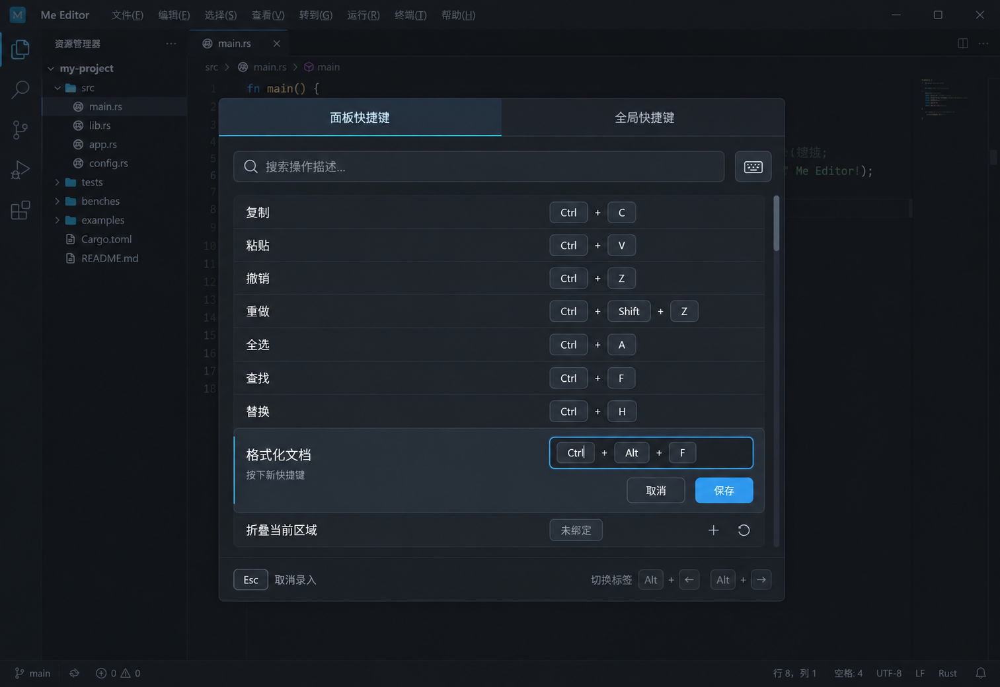

# 快捷键面板与用户绑定规格

日期：2026-10-07

稳定标识：`ui-keyboard-shortcuts-panel`

状态：产品交互、C 视觉方案及应用级测试接缝已确认（2026-10-07），全部三单已交付并推送主分支，#81–#83 关闭状态已读回。实际结果和验证限制见[阶段验收记录](../verification/keyboard-shortcuts.md)。

议题：[设计规格 #77](https://github.com/T-miracle/Editor/issues/77)，标签 `ready-for-agent`；三张实施工单已获批准并发布为 #81–#83，用户已授权执行，按依赖关系实施与验收；父规格保持原样且不关闭。

## Problem Statement

用户需要快速查找当前面板和整个编辑器可用的快捷键，并按个人习惯修改绑定。规格整理时，宿主命令、基础输入控件和插件命令的快捷键分散处理，快捷键设置仍是占位，缺少统一的查询、修改、冲突提示和持久保存体验。

快捷键还受焦点与面板作用域影响。用户需要知道一个操作在什么位置生效，避免在不同工作区重复配置，或因为打开查询面板改变焦点而失去原面板的信息。插件暂时禁用或卸载时，用户也不希望丢失自己设置的绑定。

## Solution

提供主窗口内的快捷键模态弹层，默认通过 `Ctrl+K` 打开。弹层使用已选定的 C 方案：深色紧凑布局、顶部固定双 tab、固定搜索区、独立滚动列表、行内修改以及底部右侧的切换提示。浅色主题使用同一结构并遵守项目主题契约。

两个 tab 分别展示打开前焦点面板的快捷键和应用内全局快捷键。用户可以按操作描述搜索，也可以开启按键搜索，通过实际按键查找绑定。用户可以在列表中为宿主、基础编辑操作及插件命令添加、修改、删除和恢复绑定。

自定义绑定以用户级配置持久保存，在所有工作区使用同一配置，但不改变命令原有作用域。支持每个操作多个绑定，以及最多两步的连续快捷键。冲突必须显式处理，不能按注册或安装顺序静默覆盖。

## User Stories

1. As an editor user, I want to open the shortcuts panel with Ctrl+K, so that I can look up shortcuts without leaving my work.
2. As an editor user, I want to change the shortcut that opens the panel, so that it fits my existing habits.
3. As an editor user, I want an application-menu entry for shortcuts, so that I can recover after forgetting or removing the opening binding.
4. As an editor user, I want a masked modal inside the main window without a title bar or close button, so that the shortcut controls remain the focus.
5. As an editor user, I want Escape or a backdrop click to dismiss the panel when I am browsing, so that I can return to work quickly.
6. As an editor user, I want the original panel to regain focus after dismissal, so that I can continue where I stopped.
7. As an editor user, I want panel shortcuts to refer to the panel focused before opening, so that focusing the search input does not change the list.
8. As an editor user, I want global shortcuts separated from panel shortcuts, so that their activation scope is clear.
9. As an editor user, I want the panel tab selected initially and the global tab used when the original panel has no shortcuts, so that the initial content is useful.
10. As an editor user, I want an empty focused search field whenever I reopen the panel, so that I can immediately start a new lookup.
11. As an editor user, I want full-width tabs and a fixed search area, so that navigation stays available while I scroll.
12. As an editor user, I want descriptions on the left and keycaps on the right, so that I can scan operations and bindings quickly.
13. As an editor user, I want the panel size to remain stable when results change, so that controls do not move while I search.
14. As an editor user, I want the modal to shrink within a small window, so that its controls remain reachable.
15. As an editor user, I want Alt+Left and Alt+Right to switch tabs, so that I can compare scopes using the keyboard.
16. As an editor user, I want a fixed bottom-right hint with text and key icons, so that I can discover tab navigation.
17. As an editor user, I want description text to filter the current tab immediately, so that I do not need a separate search submission.
18. As an editor user, I want the search condition preserved when switching tabs, so that I can inspect the same query in both scopes.
19. As an editor user, I want a keyboard button to toggle shortcut capture for searching, so that typing descriptions and searching by keys remain distinct.
20. As an editor user, I want captured search keys to avoid executing commands, so that looking up an operation cannot change my document.
21. As an editor user, I want the first stroke to find matching single-stroke bindings and two-stroke prefixes, so that I can find a shortcut before remembering its full sequence.
22. As an editor user, I want a second captured stroke to narrow results to the complete sequence, so that I can identify the exact binding.
23. As an editor user, I want modifier keys matched exactly, so that Ctrl+K is not confused with Ctrl+Shift+K.
24. As an editor user, I want unbound operations shown in the list, so that I can assign shortcuts to them.
25. As an editor user, I want to edit host, basic editing and plugin shortcuts in one place, so that I do not need separate configuration workflows.
26. As an editor user, I want multiple bindings for an operation, so that I can retain a familiar shortcut while adding another.
27. As an editor user, I want to add, change and delete individual bindings and restore an operation's defaults, so that I can maintain my configuration.
28. As an editor user, I want to edit a binding inline with Save and Cancel, so that I keep the surrounding list context.
29. As an editor user, I want the previous binding retained until I save, so that partial input cannot change the active configuration.
30. As an editor user, I want a saved binding to take effect immediately and survive restart, so that no extra reload or repeated setup is needed.
31. As an editor user, I want the same user configuration across workspaces while retaining command scopes, so that consistency does not make panel actions fire elsewhere.
32. As an editor user, I want conflicts reported before saving, so that an existing command is not silently displaced.
33. As an editor user, I want to explicitly replace a conflicting binding or cancel the change, so that I control which operation keeps the shortcut.
34. As an editor user, I want non-overlapping panels to reuse the same keys, so that local shortcuts need not be globally unique.
35. As an editor user, I want a short binding that occupies a longer sequence's prefix treated as a conflict, so that single-stroke commands do not acquire a delay.
36. As an editor user, I want shortcuts of up to two strokes, so that I can assign additional combinations without supporting arbitrarily long sequences.
37. As an editor user, I want a next-stroke hint and a two-second execution timeout, so that I can understand and leave an incomplete sequence.
38. As an editor user, I want an unmatched second stroke handled normally, so that an incomplete shortcut does not swallow unrelated input.
39. As an editor user, I want capture to use the same two-second interval for an optional second stroke, so that one-stroke and two-stroke bindings can be entered consistently.
40. As an editor user, I want Escape to cancel capture before closing the whole panel, so that an input mistake is easy to undo.
41. As an editor user, I want Alt+Left and Alt+Right captured instead of navigating while capture is active, so that those combinations can also be searched and assigned.
42. As an editor user, I want a discard-or-continue choice before leaving unsaved edits, so that switching tabs, editing another item or closing does not silently lose work.
43. As an editor user, I want new letter and digit bindings to require a modifier beyond Shift, so that plain typing is not reassigned accidentally.
44. As an editor user, I want function and navigation keys usable without modifiers, so that suitable non-text keys remain available.
45. As an editor user, I want disabled or uninstalled plugin operations hidden and inactive while their custom configuration is retained, so that unavailable commands do not interfere with work.
46. As an editor user, I want surviving plugin commands to recover saved bindings when the plugin returns, with conflicts reported first, so that my preferences are preserved safely.
47. As an editor user, I want Chinese and English text, light and dark themes, keyboard focus and Chinese IME to remain usable, so that the panel follows the editor's existing accessibility and localization conventions.

## Implementation Decisions

### 1. 术语与产品范围

| 术语 | 本规格中的含义 |
| --- | --- |
| 快捷键面板 | 本次新增的查询与修改绑定弹层 |
| 原面板 | 打开快捷键面板前获得焦点的编辑器、文件树、终端等区域 |
| 面板快捷键 | 受原面板上下文限制的操作绑定，不指快捷键弹层自身的操作 |
| 全局快捷键 | 编辑器应用内通用绑定，不是应用失焦后仍可触发的系统热键 |
| 一步按键 | 主键及其同时按下的修饰键，例如 Ctrl+Shift+C |
| 连续快捷键 | 依次按下的两步按键，例如 Ctrl+J → Ctrl+C |
| 录入 | 捕获按键作为搜索条件或待保存绑定，而不是执行对应命令 |

宿主、插件包、贡献、实例和作用域沿用项目领域约定。用户配置的适用范围与命令的触发作用域是两件事：跨工作区共用配置不意味着跨面板触发命令。

### 2. 打开、遮罩与焦点

- 默认通过 `Ctrl+K` 打开；该绑定本身允许修改或解除，应用菜单保留“快捷键”入口。
- 在主窗口内部居中显示模态弹层，遮罩覆盖主窗口并阻止背景交互。不创建另一个带系统标题栏的窗口。
- 不显示标题栏和关闭按钮。普通浏览状态下，`Esc` 或点击遮罩关闭弹层。
- 打开时记录原面板上下文；搜索框获取焦点后仍使用该上下文。
- 默认选择“面板快捷键”；原面板没有快捷键时选择“全局快捷键”。
- 每次打开清空搜索并聚焦搜索框。关闭后恢复原面板焦点。
- 有未保存修改时的关闭规则，以及录入期间的 `Esc` 优先级，按后文状态表处理。

### 3. C 方案布局与本地 UI

- 采用 C 方案的紧凑层级、细边框、键帽、蓝色焦点强调和行内展开编辑形式。原型展示深色主题，不取消项目已有浅色主题要求。
- 默认宽约 760、高约 560 个逻辑像素；小窗口下自适应缩小。结果数量变化时不跟随内容伸缩。
- 从上到下依次为：全宽固定双 tab、固定搜索区、可滚动列表、固定底部提示区。
- tab 文本为“面板快捷键”“全局快捷键”。搜索区包含搜索输入框和独立键盘按钮。
- 列表左侧为操作描述，右侧为快捷键显示；无绑定的操作显示“未绑定”并可添加。
- 只有列表滚动。顶部和底部区域不随列表滚动，行内编辑不能挤掉固定区域。
- 底部右侧固定使用文字和按键图标提示 `Alt+← / Alt+→` 切换 tab；录入时该切换行为暂不可用，提示应体现当前状态。
- 可见控件以 `gpui-base` 行为为基础，参考 `gpui-component` 对应实现，外观由项目本地 UI 层组合。不得直接交付上游成品外观或复制整套上游源码。
- 文案使用现有 i18n 机制，保留简体中文和英文；颜色和尺寸接入项目主题与缩放契约。

### 4. 搜索与 tab 导航

- 默认输入文字，按操作描述实时过滤，不设置额外的提交搜索步骤。
- 搜索仅筛选当前 tab。切换 tab 保留搜索条件。
- 键盘按钮切换按键搜索模式；再次点击退出该模式。
- 按键搜索只更新搜索条件，不执行被录入快捷键对应的命令。
- 第一步按键同时匹配同样的单步绑定和以它开头的两步绑定；第二步录入后匹配完整序列。
- 修饰键精确匹配；`Ctrl+K` 不匹配 `Ctrl+Shift+K`。
- 普通浏览或文字搜索时，`Alt+← / Alt+→` 切换 tab；按键搜索和绑定录入时，两者作为录入内容，不切换 tab。

### 5. 可管理操作与配置

- 纳入宿主命令、基础编辑操作和插件贡献的命令，包括保存、复制、粘贴、撤销等，不只管理应用自定义命令。
- 统一展示有绑定与未绑定的可管理操作；不能因为当前没有快捷键而隐藏命令。
- 一个操作支持多个绑定。每组绑定可独立添加、修改或删除，并提供恢复该操作默认绑定的入口。
- 修改配置不改变命令原有作用域、权限或可用条件。
- 配置保存到用户级设置，所有工作区共用，重启后保留；不按项目分别覆盖。
- 实现必须覆盖实际事件分发，不能只修改列表显示而让原始宿主、控件或插件绑定继续独立触发。

### 6. 行内编辑与未保存修改

- 点击右侧快捷键在当前行录入新绑定，显示“保存 / 取消”。
- 编辑期间保持旧的已保存配置。明确保存并通过校验后，新绑定立即生效且持久保存。
- 无效输入、尚未处理的冲突不能直接保存。
- 关闭弹层、切换 tab 或开始编辑另一项时，如有未保存修改，提示“放弃修改 / 继续编辑”；选择放弃后才完成原操作。
- 录入状态下按 `Esc` 是上述离开确认的明确例外：直接取消当前录入，丢弃当前未保存修改并回到普通状态；之后再按 `Esc` 关闭弹层。

| 当前状态 | 输入或动作 | 结果 |
| --- | --- | --- |
| 普通浏览、文字搜索 | Esc | 关闭弹层并恢复原焦点 |
| 按键搜索录入 | Esc | 退出按键录入，不关闭弹层 |
| 绑定录入 | Esc | 取消当前录入、不保存，回到普通状态 |
| 普通浏览、文字搜索 | Alt+← / Alt+→ | 切换 tab，保留搜索条件 |
| 按键搜索或绑定录入 | Alt+← / Alt+→ | 捕获按键，不切换 tab |
| 存在未保存修改 | 点击遮罩、切换 tab、编辑另一项 | 先选择放弃修改或继续编辑 |
| 绑定编辑 | 保存且校验通过 | 应用并持久保存绑定 |
| 绑定编辑 | 取消 | 放弃草稿，保留原绑定 |

### 7. 连续快捷键与输入限制

- 支持一步或两步，最多两步，不支持三步及更长序列。
- 执行连续快捷键时，第一步后提示下一步，最多等待 2 秒；超时取消。
- 第二步不匹配时取消当前等待，并将该按键按正常方式处理，不吞掉用户输入。
- 录入时第一步立即显示；2 秒内接收第二步则组成两步绑定，没有第二步则作为单步。录入结束不等于保存。
- 新绑定中的字母和数字必须搭配 `Ctrl`、`Alt` 等修饰键，仅 `Shift` 不够。每一步都遵守这个限制。
- 功能键、方向键等非文字按键可以单独使用。`Esc` 在本面板录入流程中仍遵守取消规则，不能因录入事件传播而同时关闭整个弹层。

### 8. 冲突判定与显式替换

- 只有在同一上下文可能同时触发时才判定冲突。互不重叠的面板允许复用按键；全局与面板操作可能发生重叠，不能仅按 tab 分开判定。
- 完全相同的绑定，以及短绑定占用两步绑定的第一步，都属于冲突。
- 例如同一作用域内 `Ctrl+K` 与 `Ctrl+K → Ctrl+C` 不允许共存，不能通过延迟打开面板解决。
- 显示冲突操作并禁止直接保存；用户可以取消，也可以显式选择“替换原绑定”，解除冲突的旧绑定。
- 替换以发生冲突的绑定为单位，不擅自删除同一操作的其他无冲突绑定。
- 恢复默认与插件重新激活也必须遵守冲突原则，不按加载顺序覆盖有效绑定。

### 9. 插件生命周期与通用能力边界

- 禁用或卸载插件后，保留用户的自定义绑定配置；相关操作从列表隐藏，也不响应按键。
- 重新启用或安装同一插件时，为仍然存在的命令恢复配置；新冲突必须提示处理，不覆盖其他绑定。
- 宿主通过通用贡献与命令管理整合插件快捷键。不得按具体插件 ID、语言名称或服务器名称写专属分支。
- 规格整理时插件快捷键来源与 GPUI 绑定来源不同，且快捷键分发没有现成的面板分类；实现不能凭命令名称或插件名称猜测作用域。
- 若现有公开契约不足以表达所需命令元数据或作用域，应扩展可复用的公开契约并同步消费者，不增加测试专用或单插件专用 API。
- 快捷键配置不能授予插件权限，也不能绕过受限工作区对插件和语言工具的限制。

### 10. 模块职责与既有约束

- 应用层负责弹层生命周期、打开入口、焦点上下文、用户配置与顶层命令集成。
- 本地 UI 层负责双 tab、搜索、键帽、列表、行内录入、确认提示与主题外观。
- 编辑器、文件树、输入控件与通用插件集成提供其操作和实际作用域，通过一致的配置与分发规则响应绑定。
- 复用现有模块和公开接口，不为本功能机械新增 crate，不建立仅转发调用的包装层。
- 保持 `EditorState` 为文本与会话 Undo/Redo 的唯一真相来源，编辑命令继续经过 `DocumentSession`，不能为快捷键管理维护第二份文档状态。
- 现有设置模态窗口的标题栏与独立窗口行为不是本弹层的设计依据；复用行为接缝时仍须满足本规格的主窗口内遮罩要求。

## Testing Decisions

### 主要测试接缝：已确认

优先复用一个主要的应用级验证入口：**通过现有 GPUI 应用测试上下文启动编辑器，模拟用户按键和点击，检查可见界面、实际命令效果以及重新启动后的配置行为。**

插件场景沿同一条路径，从有效插件包进入现有公开管理器，再在编辑器中观察命令出现、快捷键触发、禁用和恢复。这里复用既有包管理与应用测试边界，不新增插件专用测试 API。

两秒等待使用既有测试执行器可控时间驱动；配置和插件存储使用隔离测试目录，不修改开发者真实用户设置。若现有设施不足，再在应用启动依赖边界补充最小替换点，不为每个 UI 状态新增内部接口。

用户于 2026-10-07 明确确认上述测试入口：复用现有 GPUI 应用入口，通过模拟按键、点击及重启验证行为。后续工单沿用这一接缝，不重新拆建各层测试入口。

### 测试原则与既有先例

- 断言用户可以观察到的行为：显示哪些操作、命令是否执行、焦点是否恢复、配置重载后是否仍生效。不以私有字段形状、内部映射顺序或辅助函数调用次数作为主要证明。
- 复用现有设置窗口 GPUI 测试的应用初始化、模拟点击、模拟按键、布局定位与重新打开方式；不复制它对“另开一个窗口”和“必须有标题栏”的断言。
- 复用现有插件管理测试从真实声明式包进入公开管理器的方式，以及原生插件面板与快捷键隔离测试的交互驱动。
- 纯绑定校验与冲突规则可以有针对性的小范围测试，但不能代替实际按键分发与保存重载的应用级验证。
- 覆盖应用集成、本地 UI、用户配置、基础输入与编辑操作、通用插件命令生命周期。测试功能行为，不通过绑定面板绕开命令真实权限与作用域。

### 拟定行为验收矩阵

| 编号 | 场景 | 可观察的通过标准 |
| --- | --- | --- |
| T01 | 默认打开与菜单兜底 | Ctrl+K 打开；修改或删除打开绑定后，菜单仍可进入 |
| T02 | 弹层结构与背景隔离 | 主窗口内显示遮罩；无标题栏、无关闭按钮；背景不响应交互 |
| T03 | 焦点上下文 | 编辑器、文件树和插件面板分别打开时，列表保留打开前上下文；关闭恢复原焦点 |
| T04 | 初始 tab 与搜索 | 有面板快捷键时选面板 tab，否则选全局；每次重新打开搜索为空并获得焦点 |
| T05 | 固定布局与滚动 | 长列表和行内编辑只滚动列表；顶部搜索与底部提示保持可见，空结果不改变弹层尺寸 |
| T06 | 文字搜索与切换 | 文字实时筛选当前 tab；Alt+方向切换 tab 后保留条件，其他 tab 不混入当前结果 |
| T07 | 按键搜索 | 开关可切换模式；搜索按键不触发保存、粘贴、插件调用等实际操作 |
| T08 | 序列搜索与精确匹配 | 第一步列出单步及两步前缀匹配，第二步只保留完整匹配；不同修饰键不混淆 |
| T09 | 录入中的导航 | Alt+方向成为录入内容；Esc 仅退出当前录入，再按一次才关闭 |
| T10 | 可管理操作覆盖 | 宿主、基础编辑与有效插件命令都可查询和修改；未绑定操作可添加 |
| T11 | 多绑定与默认值 | 同一操作各绑定独立生效；修改、删除一组不破坏其他组；可恢复默认 |
| T12 | 行内编辑提交 | 未保存时原配置保持；取消不应用；保存后新配置在实际事件分发中生效 |
| T13 | 用户级持久化 | 切换到另一个工作区及重启后读取同一绑定；终端等面板操作不会在其他面板误触发 |
| T14 | 完全相同绑定冲突 | 重叠作用域显示冲突，取消保留旧配置，显式替换解除对应旧绑定 |
| T15 | 作用域与前缀冲突 | 不重叠面板可复用；全局与面板的重叠被识别；短绑定与两步前缀不能共存 |
| T16 | 连续快捷键执行 | 第一步有提示；2 秒内第二步匹配后执行一次；超时不执行，不匹配按键正常处理 |
| T17 | 连续快捷键录入 | 第一步立即显示；2 秒无第二步形成单步；两步输入可保存；不支持三步绑定 |
| T18 | 新绑定限制 | 单独字母、数字及仅 Shift 修饰的文字键不能保存；允许符合条件的修饰组合与功能键 |
| T19 | 未保存修改保护 | 点击遮罩、切换 tab、编辑另一项均先确认；继续编辑保留草稿，放弃后完成目标操作；Esc 遵守直接取消例外 |
| T20 | 插件停用与移除 | 列表和事件响应及时撤销，自定义配置保留；受限工作区不会因查找或修改绑定启动插件 |
| T21 | 插件恢复与冲突 | 同一插件仍存在的命令恢复配置；有新冲突时提示，不抢占有效绑定 |
| T22 | 主题、语言与原生输入 | 深浅主题、中英文、中文 IME、键盘焦点、小窗口、滚动及缩放下内容与操作可用 |

### 实施阶段验证要求

- 执行仓库规定的 Rust 格式检查、非 UI workspace 测试、workspace 编译检查，并补充受影响的 editor-app 测试与 Windows 原生交互验收。
- 涉及真实 WASM 包时，先按已有验证约定构建夹具并显式执行相关 ignored 测试，不能把跳过当作通过。
- 原型图只验证设计表达，不能代替真实按键、焦点、IME、保存重载与插件生命周期验收。
- 规格整理阶段仅交付规格与原型引用；授权实施后的真实行为测试进展记录在[阶段验证记录](../verification/keyboard-shortcuts.md)，不能将规格验收矩阵直接当作已通过结果。

## Out of Scope

- 从快捷键列表点击执行命令，或将本面板扩展为命令面板。
- 编辑器失焦后仍响应的操作系统全局热键。
- 项目专属绑定覆盖、跨设备同步、快捷键配置市场或导入导出。
- 三步及更长连续快捷键；通过延迟执行来允许短绑定与长绑定前缀共存。
- 独立系统弹窗、多窗口或自由停靠能力扩展。
- 插件专用宿主分支、绕过权限与工作区信任、未授权插件自动启用。
- 更换项目原生 UI 技术、使用 WebView 实现该面板。
- 规格整理阶段不包含功能编码和 Git 提交推送；后续已获授权的三单实施见发布状态。插件独立发版及无关工单仍不在本任务范围。

## Further Notes

### 已选择的视觉原型

用户已从 A、B、C 三份原型中选择 C。下图用于表达紧凑布局、键帽、录入高亮、保存与取消按钮、固定搜索区和底部提示。

该图是生成式静态设计原型，不是运行中的编辑器截图。图中的示例命令和按键不构成默认绑定清单；背景编辑器、精确色值、文字抗锯齿与像素尺寸也不覆盖项目主题契约和正文规则。实现时必须保留浅色主题与本地化。

### 规格整理时的现状与技术细化

- 整理时已检索到宿主 GPUI 绑定、基础输入绑定和单独处理的插件清单快捷键，尚无覆盖三者的统一可编辑模型；后续统一模型与事件分发已随 02 实施。
- 现有快捷键设置页面为占位。现有设置对话框是带标题栏的独立模态窗口，本功能须满足不同的遮罩弹层形态。
- 命令稳定标识、作用域表达、用户覆盖的存储格式、公开契约变更及错误恢复需要在实现设计中细化；本文不虚构这些接口已经存在。
- 当前“所有操作可修改”不意味着将普通文本输入事件都建模为命令，也不意味着宿主可以代理修改终端内部程序自身的按键配置。
- 未经讨论的产品规则不能伪装成已确认决策；实现中的常规细节遵守现有约定，若出现改变已确认行为的取舍再单独提出。
- 工作区在本次文档整理前已有大量改动；它们不属于本规格交付成果。

### 相关依据

- [项目需求基线](../../需求整理.md)与[开发计划](../../开发计划.md)。
- [领域文档约定](../../agents/domain.md)与[插件平台公开能力规格](../../specs/plugin-api-platform.md)。
- [议题跟踪器](../../agents/issue-tracker.md)与[分诊标签](../../agents/triage-labels.md)。
- [原生 UI 文档目录](../README.md)。

### 发布状态

- 产品交互：已逐项确认；视觉原型：已选择 C。
- 测试接缝：已确认复用现有 GPUI 应用入口，模拟按键、点击及重启验证行为。
- GitHub 议题：[设计规格 #77](https://github.com/T-miracle/Editor/issues/77) 保持原样；三张实施工单已获批准并发布为 [#81](https://github.com/T-miracle/Editor/issues/81)、[#82](https://github.com/T-miracle/Editor/issues/82)、[#83](https://github.com/T-miracle/Editor/issues/83)，原生阻塞关系按此顺序建立并读回验证。
- 实现与行为验收：01、02、03 分别以 `495a1d0`、`66fb23a`、`9d91893` 交付并核对关闭；最终串行应用测试 384 passed、相关 9 项真实 WASM 场景和必要原生组合通过。T01–T22 证据及未全量执行范围见[验收记录](../verification/keyboard-shortcuts.md)。
- [三单实施工单与测试归属](../tickets/keyboard-shortcuts/README.md)：粒度和阻塞关系已批准，共用测试入口并遵守仓库阶段检查。
