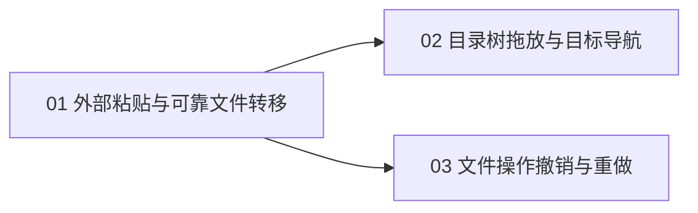

# 资源管理器文件转移实施工单

状态：三张工单已发布并按 01 → 02 → 03 完成代码与自动验证；Windows 原生联合验收尚未完成，议题保持打开。

来源：[资源管理器文件转移规格](../../specs/explorer-file-transfer.md)。产品交互与主要测试接缝均已确认。

设计议题：[GitHub #76](https://github.com/T-miracle/Editor/issues/76)；[发布记录](publication.json)保存已读回核对的真实映射。三张工单均使用 `ready-for-agent`。

按较粗的端到端功能拆成 3 张工单，不按平台、单个按钮、底层模块或单条测试拆票。

| 序号 | 工单 | 阻塞项 | 可演示结果 |
| --- | --- | --- | --- |
| 01 / [#78](https://github.com/T-miracle/Editor/issues/78) | [外部粘贴与可靠文件转移](01-file-paste.md) | 无 | 系统复制/剪切后粘贴，完成冲突处理、后台执行、取消及标签同步 |
| 02 / [#79](https://github.com/T-miracle/Editor/issues/79) | [目录树拖放与目标导航](02-tree-drag-drop.md) | #78 | 树内移动/复制、外部拖入，以及目标高亮、悬停展开和边缘滚动 |
| 03 / [#80](https://github.com/T-miracle/Editor/issues/80) | [文件操作撤销、重做与冲突恢复](03-file-undo-redo.md) | #78 | 从菜单及快捷键撤销、重做，处理后续变化与强制撤销确认 |

## 拆分理由与实施顺序

- 01 是完整的外部粘贴闭环，同时建立各入口共用的目标解析、复制/移动、冲突选择、后台任务、覆盖备份及实际完成记录。后两票不重新定义文件操作策略。
- 02 新增拖放输入、视觉反馈和导航；03 使用 01 的完成记录和备份，不要求先有拖放入口。二者互不构成技术阻塞。
- 推荐顺序为 01、02、03，减少同一 UI 与会话代码的来回切换；推荐顺序不是额外阻塞边，也不授权自动委派多个代理。
- 预重构限定在 01 的第一步：先整理现有粘贴执行边界并用已有场景验证，再增加新行为。没有必须单独发票的广域机械重构。
- 规格是设计依据，不是需要关闭的阻塞议题。三票均完成且联合验收通过后，整个规格才能标记交付。

## 测试归属与去重

| 验证内容 | 主要归属 | 后续如何复用 |
| --- | --- | --- |
| 复制/剪切、目标解析、冲突与合并、取消、失败、链接跳过、文档同步、错误提示 | 01 | 复用同一用例与工作区夹具，不因入口不同复制整个组合矩阵 |
| 拖动手势、修饰键、原生拖入、目标高亮、悬停、滚动、取消恢复 | 02 | 通过代表性冲突/失败场景证明接入 01，不重复完整公共规则的人工验收 |
| 记录、备份恢复、撤销与重做、强制确认、焦点及会话清理 | 03 | 通过真实粘贴生成记录，不依赖尚未交付的拖放入口 |
| Windows 外部导入 → 树内移动 → 撤销 → 重做 | 最后一票完成后集中一次 | 复用各票已有证据，仅补跨入口衔接及最终可见结果，不另拆纯测试票 |

- 已确认主入口为现有资源树 GPUI 交互测试，补充 Windows 系统剪贴板、拖放的真实操作验收，不为每票搭建不同测试系统。
- 每张实现工单先运行相关用例，完整变更稳定后集中执行一次仓库规定的格式检查、非 UI workspace 测试、workspace 编译检查及相关 editor-app 测试。不为每个函数、按钮或验收条目重复跑全套。
- 不以减少重复测试为由跳过每阶段必需检查；仅新增改动、失败或未解除风险才扩大或重跑验证。
- 明暗主题、平台分支与错误路径随本票验证，不另拆平台或主题票。macOS/Linux 无运行环境时记录未验收，不擅自安装工具链。

## 发布与执行

- 用户已批准三票粒度和两条依赖边，并明确要求在从主分支创建的新工作区依次实现。
- GitHub 原生阻塞关系已读回核对：#79 与 #80 均由 #78 阻塞。
- 每票完成后记录实际验证、审查与提交结果，再核对对应议题；设计父议题不作为执行阻塞项。
- [验收记录](../../verification/explorer-file-transfer.md)保存测试归属、原生交互证据及平台限制。

返回[原生 UI 文档目录](../../README.md)。
