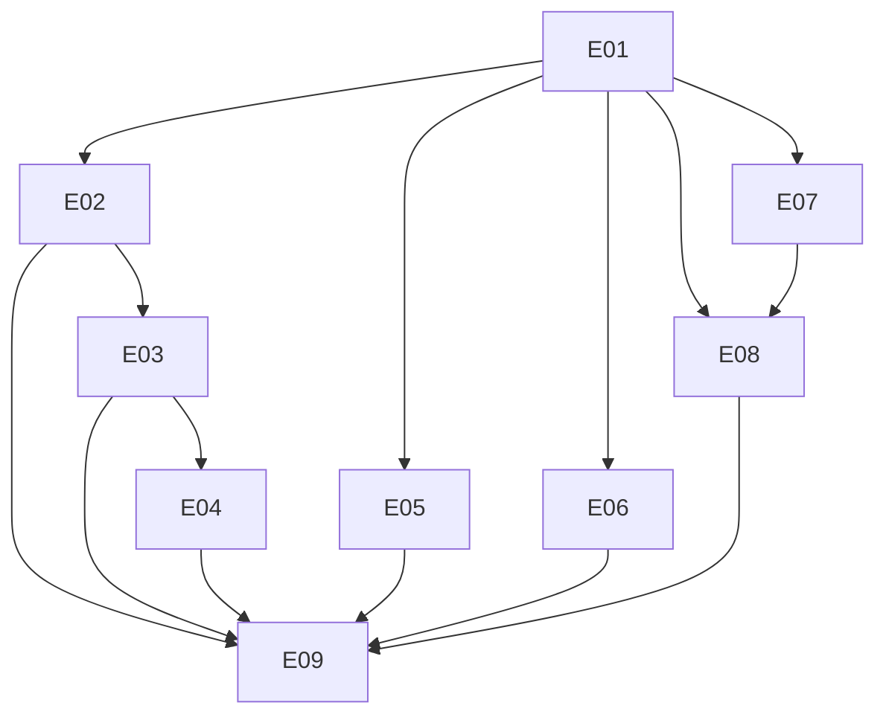

# 编辑器文档站点：规格与实施工单

状态：**已发布到 GitHub**（2026-10-04）。方案 [#38](https://github.com/T-miracle/Editor/issues/38)，实施工单 [#39](https://github.com/T-miracle/Editor/issues/39)–[#47](https://github.com/T-miracle/Editor/issues/47)，全部应用 `ready-for-agent` 标签，14 条原生阻塞边已建立并读回核对。
日期：本轮整理。依据：[静态文档站点方案](../specs/static-docs-site.md)、用户逐项确认的决策、`/to-spec` 与 `/to-tickets` 流程。

测试接缝已由用户确认（见规格 Testing Decisions）。真实编号、数据库 ID 与依赖边见 [publication.json](publication.json)。

## 来源与边界

- 方案（决策、目录树、迁移映射、防漂移机制、风险）：[specs/static-docs-site.md](../specs/static-docs-site.md)。
- 交接（状态、边界、下一步）：[handoff/static-docs-site-handoff.md](../handoff/static-docs-site-handoff.md)。
- 规格正文落在 `docs/` 工作面的哪个位置，见 `docs/README.md` 的存放约定；本目录不重复方案内容。

## 发布状态

已发布并读回核对，无需再处理发布：

| 条件 | 状态 |
| --- | --- |
| 议题发布 | 已完成：方案 #38、工单 #39–#47，均带 `ready-for-agent` |
| 原生阻塞边 | 已完成：14 条，读回结果与依赖图一致（E01 blocking=5，E09 blockedBy=6） |
| 站点点位 | 用仓库已有的 Git 凭据完成认证；令牌未写入仓库，发布脚本与暂存文件均在仓库外 |
| Node 工具链 | **未满足**：系统未安装 node/npm，E01 开始前需先解决 |
| GitHub Pages | **未满足**：`has_pages=false`，需用户在仓库设置中把来源切到 GitHub Actions |

## 工单编号与阻塞关系

| 序号 | 稳定标识 | 标题 | 直接阻塞项 | GitHub |
| --- | --- | --- | --- | --- |
| E01 | `docs-site-01` | 建立双语文档站点骨架与链接测试 | 无 | [#39](https://github.com/T-miracle/Editor/issues/39) |
| E02 | `docs-site-02` | 迁入能力协议文档并确定英文权威版 | E01 | [#40](https://github.com/T-miracle/Editor/issues/40) |
| E03 | `docs-site-03` | 补齐能力协议的中文译文 | E02 | [#41](https://github.com/T-miracle/Editor/issues/41) |
| E04 | `docs-site-04` | 用站点源驱动 SDK 导出并回归分发验证 | E03 | [#42](https://github.com/T-miracle/Editor/issues/42) |
| E05 | `docs-site-05` | 撰写编辑器使用指南 | E01 | [#43](https://github.com/T-miracle/Editor/issues/43) |
| E06 | `docs-site-06` | 撰写插件安装与管理说明 | E01 | [#44](https://github.com/T-miracle/Editor/issues/44) |
| E07 | `docs-site-07` | 用 GitHub Actions 部署到项目站并核验真实链接 | E01 | [#45](https://github.com/T-miracle/Editor/issues/45) |
| E08 | `docs-site-08` | 接入站内搜索与文档源测试 | E01、E07 | [#46](https://github.com/T-miracle/Editor/issues/46) |
| E09 | `docs-site-09` | 完成整站双语与链接终验并交付 | E02、E03、E04、E05、E06、E08 | [#47](https://github.com/T-miracle/Editor/issues/47) |

传递依赖不重复列出。E01 是唯一共同前置，完成后 E02、E05、E06、E07 可分别推进。

## 实施前沿

- E01 立即可开始（其内部前置检查见该工单）。
- E01 完成后，E02（迁入 SDK 文档）、E05（使用指南）、E06（插件安装与管理）、E07（部署流水线）互不阻塞，可分别推进；E08 还需 E07 提供真实站点的链接核验基础。
- E04 是 SDK 链路的关键验证点：它证明站点源确实是导出内容的唯一来源。
- E09 必须等待全部前置完成，不得在缺页或断链状态下宣称交付。

## 被否掉的选项与代价

- 迁移前先给 `include_bytes!` 加临时兼容分支：制造双源，与"站点唯一手写源"冲突。
- 站点侧不写 `tests/links` 与 `tests/doc-sources`：双语漂移与断链将没有任何机制拦住，与已确认的防漂移决策冲突。
- 为"文档搬家"新增临时 Rust 测试：`verify-plugin-sdk.ps1` 已覆盖同一风险，属低层重复接缝。
- 先发完整站点再迁移 SDK 文档：会长期发布一份可能与 crate 内容分叉的重复文档。

## 交付完成判定

九张工单全部关闭，且：站点在项目站 URL 可访问、双语页面集合一致、站内链接与锚点经测试通过、SDK 导出内容取自站点源并通过 `verify-plugin-sdk.ps1`、搜索可命中插件 SDK 关键词。

本页的完成状态不沿用其他批次结论；只有逐项验证通过后才标记完成。
